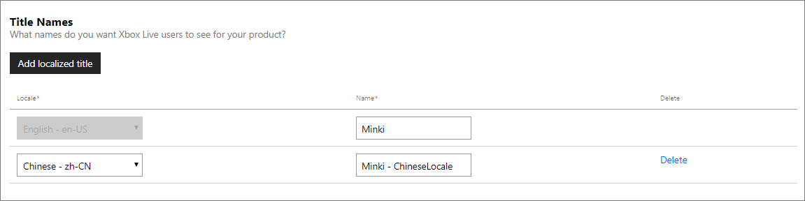
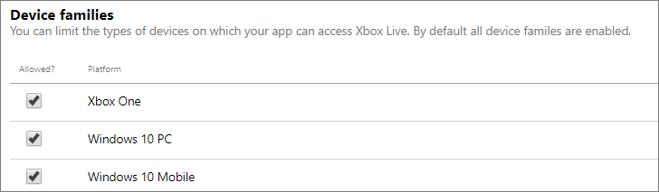

# Configuring Xbox Live Setup in Partner Center

You can use [Partner Center](https://developer.microsoft.com/dashboard) to configure the initial set of Xbox Live properties that are associated with your game.

Add configuration by doing the following:

1. Navigate to the **Xbox Live** section for your title, located under **Xbox Live Settings**.

2. On this page, you can set the title names, default locale, device families and the embargo date. Once you are done setting your configuration, click the **Save** button to submit the changes.

## Title names

By clicking on **Add localized title**, you can enter a name for your product and select a language to localize it to.
The title name should map to the localized product names that you have defined on the properties page of the submission.
Default is English (en-US).

## Default locale

This option allows you to set the default language to be used to configure all your strings in the Xbox Live service configuration.
For example, if you set the default locale to Spanish (es-ES) and you want to configure an achievement, then at a minimum, the achievement name and description would have to be in Spanish.

In other words, you cannot set this option to Spanish but only provide the achievement information in English.
All of your Xbox Live service configuration must be provided in the same version as that of the default locale.
By default, the default locale is set to English (en-US).

> [!NOTE]
> Additionally, all strings can be localized in the Localized strings page.

## Device families

This configuration allows you to choose the type of devices on which your title can access Xbox Live.
By default, all device families are enabled.
You can check the devices to enable them.

## Embargo date

The date you select will determine when your Xbox Live configuration goes live to the public.
It is important to note that even if you published your changes to RETAIL they will not go live unless the embargo date has been met.
* If you select a date in the future, the changes will become available to the public on that date.
* If you select a date in the past, the changes will become available to the public as soon as you publish your changes to RETAIL.

Click on the date-time picker and it will expand to allow you to select the precise date and time.
Once you click **OK**, the embargo date will be set.

<!-- Explanation of Embargo from XDP UI.  -->

> [!NOTE]
> There is no direct concept of a "Catalog" Publish in Partner Center.

What is RETAIL embargo?

RETAIL Embargo provides additional protections to help limit the product's social data exposure in RETAIL via service calls or in the Xbox UI. Only the product or its custom access policies will be able to make calls to get the embargoed data. Users playing a product during the embargo period (via pre-paid token or other means) won't show any of the below content related to the product until the specified embargo date and time is reached:

* Achievements & Challenges
* Broadcasting*
* Game DVR (local capture allowed but upload prevented)
* Game Invites
* Game Progress
* Hero Stats
* Leaderboards
* Presence
* Real Time Activity
* Screenshots*
* Social Sharing*
* Stats

*embargoed is not completely covered for Broadcasting, Screenshots, or Social Sharing. You will need to make the necessary changes (check or uncheck the box) that fit your need under Product --> Properties --> Product declarations.

>[!IMPORTANT]
>In order for ALL aspects of Embargo to be functional, both a Service Configuration and Catalog publish are required. If the Embargo date is updated after publish to RETAIL, the Service Configuration and Catalog must be republished.

Content Updates to products in RETAIL should opt-out.

Embargo does not apply to:

* Custom Access Policies
* Game Hub
* Marketplace Availabilities
* Static Files (Trailers, Artwork, etc)
* Title Callable UI (TCUI)

## Advanced settings

Multiple points of presence allows the same user to sign in to Xbox Live from multiple devices at the same time.
Xbox Live features such as, achievements and multiplayer will have limited access.
Hence, this option is not recommended for games.

To set the **Multiple points of presence**, click **Show options**.
Enable this option by checking the box.
