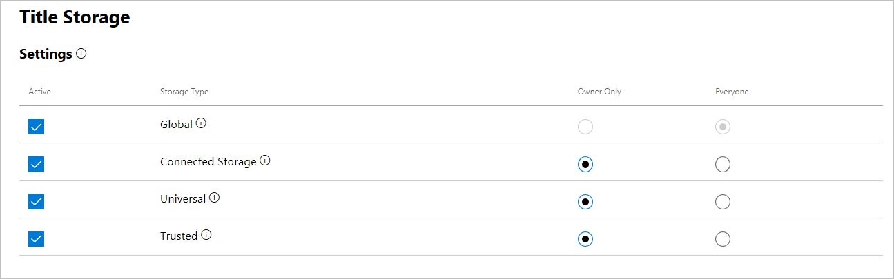
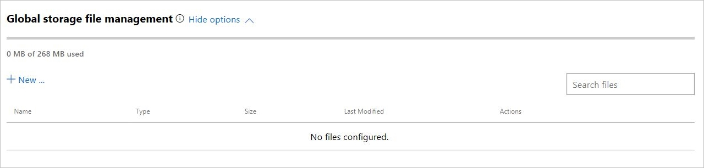
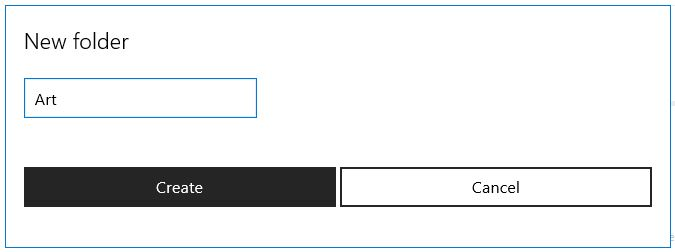
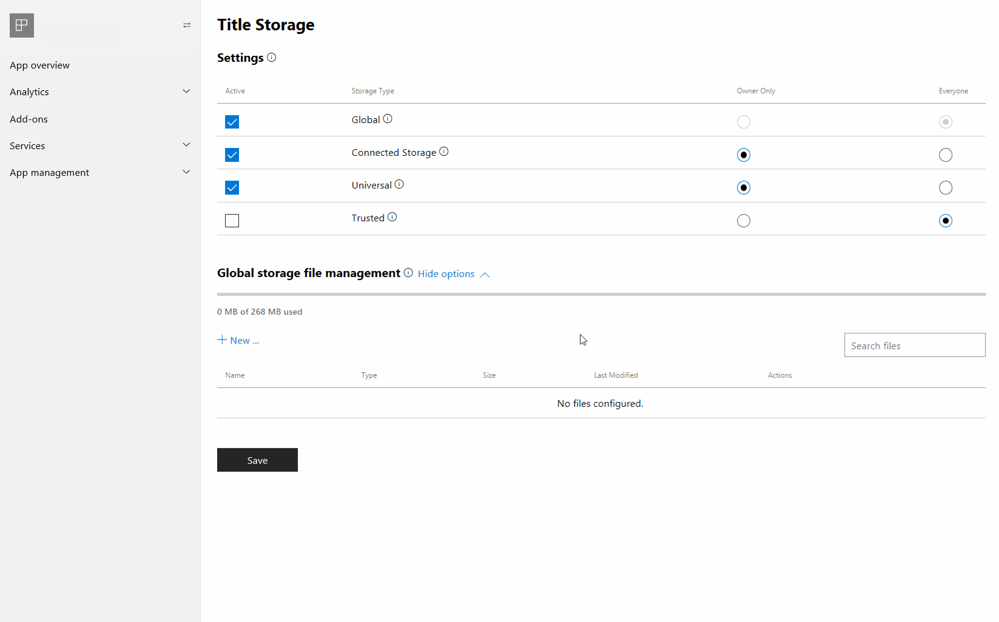

# Configuring Title Storage in Partner Center

Xbox Live allows you to save data associated with your game in the cloud through the Title Storage service.
The **Title Storage** configuration page allows you to determine what types of cloud storage services your game will allow, as well as upload files to be used for Global Storage.

To find the Xbox Live Title Storage configuration page:

1. Go to [Partner](https://partner.microsoft.com/dashboard).
2. In **Overview** or **Products**, select your app.
3. Click the **Services** drop-down, then click **Xbox Live**.

To see the Title Storage configuration options, developers in the Creators Program need to click **show options** in the **Cloud saves and storage** section of their configuration page.

To navigate to the Title Storage configuration page, those with the full set of Xbox Live features available will need to find the **Title Storage** link.

Title Storage configuration has two main sections: the Title Storage settings section, and the global storage file management section.

## Section 1: Title Storage settings

In this section, you can enable any of the four storage types by checking the box in the **Active** column.

After choosing you title's storage types you can choose whether reading the data will be restricted to the player who owns it, by clicking the storage type row's **Owner** Only radio button, or shared publicly, by clicking on the **Everyone** radio button.

If you select **Owner Only** for a given **Storage Type**, the Title Storage data of that type will only be readable by the player who generated that data.

If you select **Everyone** for a given **Storage Type**, the Title Storage data of that type will be readable by all players.

Writing or modifying saved data is only available to the user who generated it, in all cases.

## Storage types

There are four storage types which can be activated on the Title Storage configuration page.
You can find a description of each storage type by hovering over the info icon next to each storage type's name, or by reading the table below.

|Storage Type |Description |Example Usage  |
|---------|---------|---------|
|Global             |Data Uploaded to Partner Center that can be read by any device, and is accessible to every user. Can only be written to by the developer uploads to Partner Center. | Advertise updates to all users via in-game news feed.     |
|Connected Storage  |Allows background syncing of game data on XboxOne and Windows 10 Games. A robust fault tolerant game save service. Can be read by any device, can be written to by Xbox One (and later) and Windows 10 devices. | Save files for an individual user to allow play on a separate console.         |
|Universal          |Network accessible blob storage that gives read/write access to any device that is not an Xbox 360 or Windows Phone. Can be read by Android and IOS devices.      | save playtime or other stats to be accessible from multiple Windows devices.        |
|Trusted            |Network accessible blob storage that can only be written by Xbox 360 (and later) and Windows Phone. Can be read by any device. Can be read by Android and IOS.     | store a player's ranking in multiplayer.        |

## Section 2: Global Storage file management

To see the full Global Storage file management options, click the **show options** drop-down.
In this section, you can add files and folders that will be accessible if the **Global** storage type is set to active in the Title Storage settings.

Your game will need to be published for testing in order to add files in this section.
You may see a warning at the top of the Title Storage configuration page if your game is not adequately published for testing.

## Manage Global Storage files

Global storage file management allows you to upload and download files to be used for global storage.
These files can potentially be accessed by anyone who owns your title, and are meant to be shared across all players who play your game.

To see the global storage file options, click the **show options** drop-down next to the sections title.

To add your first file, click the **+ New ...** link.
You will then be given the option to add a new file or folder to your global storage files.

### New folders

When adding a new folder to your global storage files you simply need to name the folder and click the **Create** button.
Your new folder will appear in the file explorer table.

To add files to your folder, you must upload them to the folder directly, by clicking the folder's **Actions** button: "**...**", and selecting **upload files**.
You cannot drag and drop files into folders within the files explorer table.

To create a child folder, use the **create folder** action in the **Actions** menu of a folder.

To delete the folder and all of its contents, choose the **delete** action in the **Actions** menu of a folder.

### New files

When adding a new file to global storage you will be prompted to upload a file from your computer's file explorer and then asked to choose from one of the three file types, Binary, Config, and JSON.
In addition to being able to upload a file with the **+ New ...** button, you can also drag and drop files from you computer to the file explorer table.

> [!WARNING]
> You cannot drag folders into the file explorer table, attempting this action will result in the folder being treated like a file and will not work as expected.

File management actions:

#### File types

* Binary - The binary type should be used for images, sounds and custom data. This data must be HTTP friendly.
* Config - Config files hold information about your game and can have dynamic query return values based on some input.
* JSON - .json files. These files hold some information about an aspect of your game, similar to a Config file.

## See also

| Article | Description |
|---------|-------------|
| [Title Storage documentation](../live-title-storage-nav.md) | Universal, Trusted, Global Storage and storage file types. |
| [Connected Storage documentation](../../connected-storage/live-connected-storage-overview.md) | Saving game progress in the cloud so that you can continue your game between devices. |
