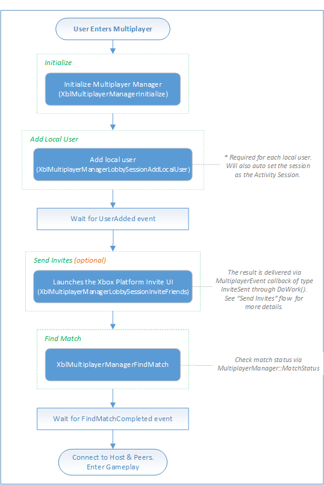

# Playing a game by using SmartMatch matchmaking (flowchart)

The following flowcharts show how to start a new multiplayer game by adding and inviting friends to the game, and then using SmartMatch matchmaking to fill any open slots with other Xbox Live members.

For code examples of this process, see [Finding a multiplayer game by using SmartMatch using Multiplayer Manager](../../how-to/live-play-multiplayer-with-matchmaking.md).

## SmartMatch matchmaking

