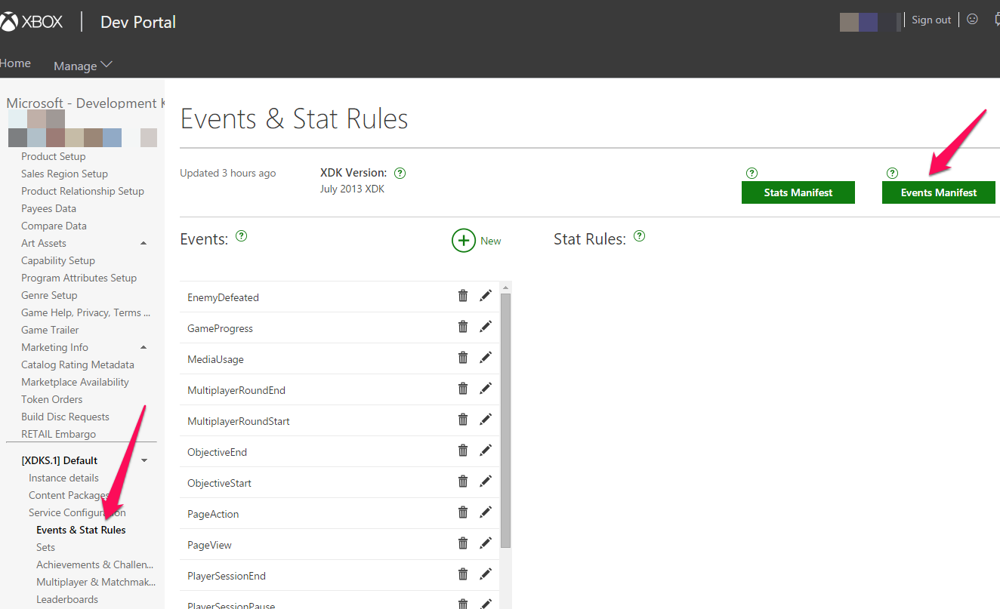

# Events overview

<!-- from old portal "Game events" article; https://developer.microsoft.com/games/xbox/docs/xdk/game-events -->

**Note:** This article only applies if you are using event-based User Stats, not title-managed User Stats.

**Note** Application Insights has been deprecated. Please use [fiddler](https://docs.microsoft.com/windows/uwp/xbox-live/using-xbox-live/troubleshooting/how-to-set-up-fiddler-for-debugging) to monitor events.


## Writing game events to the Xbox Live User Statistics service

The most exciting moments in games are when something significant happens—defeating an opponent, being defeated, moving to a location, shooting a weapon, picking a flower. By using Xbox Live, titles can share information about the important events in a player’s game. Details can be sent to the Xbox Live service, which records statistics about users. These statistics can be retrieved for use in leaderboards, matchmaking, achievements, companion experiences, and business intelligence.

With event-based Stats, the only way for a title to unlock an achievement for a player, or update a player statistic, is to send events to the Xbox Live User Statistics service. Once the event, and any data that is sent as part of the event, reaches the service, Xbox Live processes rules that you defined in the service configuration for your title to create or update user statistics, achievements, leaderboards, etc.

There are two different workflows you can use, depending on if you are developing for an Xbox One console title, or for a Universal Windows Platform (UWP) app:

* Implement events for Xbox One console titles

* Implement events for UWP apps on Windows

These two workflows are described below.


## Best practices for writing game events

* DO NOT send large amounts of data (many kb) in a single event. Most events on average should range from 500 bytes to 1kb.

* Developers should not send more than 4kb of data in a single event. Events over this size may fail silently.

* The frequency at which events are fired from the game should remain below one event per second on average. If you need events sent more frequently, consider batching up multiple events into a single event, as long as the size remains reasonable.


## Implement Events for Xbox One console titles

**Note** This section applies to implementing events for Xbox One console games only. If you are creating a Universal Windows Platform app, please see the next section in this article.

A manifest is generated by Partner Center based on any custom events that you define. The manifest is used to create a header file for use in your title. The general workflow for games that run in the exclusive partition is as follows:


### Generate the manifest

For information about the current status of Partner Center features that relate to generating manifests, view the Partner Center help, or contact your developer account manager.

**To generate the manifest**

1. Create your service configuration in Partner Center.

2. Generate a manifest file by using Partner Center.

3. Use the Xbox Common Event tool, `XCETool.exe` (found in the `%DurangoXDK%\bin` directory after you install the XDK), to create a header file for your title from the manifest file you downloaded from Partner Center.

   The header file contains function definitions for helpers that raise each of the title’s events, including all appropriate common schema events and the title’s custom events.

   The command, when run from the  command prompt, will look like the following:

   `XCETool.exe your-manifest.man -c your-manifestEvents.h`


**Note** In each header, there is a method called `EventRegister{your-title}`. This must be called as your app is starting up. Similarly, there is a method called `EventUnregister{your-title}`. This must be called at shutdown.
For the Achievements sample, with a `TitleID` of 54CE29F9 and Sandbox `XDKS.*`, the method is: `EventRegisterXDKS-54CE29F9()`

1. Include the header file (`yourmanifest.h` in the example command line) in your title’s source code.

2. Add `etwplus.lib` to the list of libraries your title links with.

3. In your title’s code, use the helper functions to raise events as the appropriate situations arise during use of the title.

4. As events are raised, they are aggregated on the console by a service that periodically 7. sends recent events to the Xbox services. After the events have been reported, statistics are updated on the servers.

   When a statistic changes, achievements and leaderboards are notified, all RTA subscribers are notified of the change, and users of the RESTful API will receive the updated statistic the next time that it is requested.


### Update statistics from your title

Your title updates statistics by raising events.

**To raise an event**

1. Link `your-manifestEvents.h` with `etwplus.lib`.

2. Call the initialization function once when the title starts.
   The initialization function will be named `EventRegister{your-app-name}`.

3. During gameplay, call functions to raise events as appropriate.
   Raise events by calling the appropriate `EventWrite{event-name}`.

4. At title shutdown, call the uninitialize function once, after you have raised all events.
   The uninitialization function is named `EventUnregister{your-app-name}`.


### Retrieve statistics from the Xbox services

There are multiple ways to access statistics, depending on your need:

* Use Xbox Live services to retrieve current statistics via the User Statistics URIs.
  This is useful whenever you want to pull statistics for reporting purposes, and you don’t require live updates.

* Call the wrapped APIs in the Microsoft.Xbox.Services.UserStatistics namespace.

* Use the Real-Time Activity (RTA) service to get notifications of statistical updates in real time.
  This is useful when you want to track statistical updates for companion titles.

* Create a leaderboard to compare the values of a statistic across friends and the community.


### Ranked statistics

You can designate any individual statistic as a ranked statistic. Designating a statistic as ranked means that a leaderboard view will be generated for it that can later be queried by the Leaderboards URIs.


## Implement events for UWP apps on Windows


### Configuration on Partner Center

Define your events as usual on Partner Center. The API to send an event is different than that for an XDK title though, and use of the manifest file is optional.
Once you have an event and stat defined in Partner Center, you can perform the following steps to send an event.


#### Without manifest file

If you don’t want to deal with the step of generating a manifest file and running XCETool (described in the next section), you can send an event using the `WriteInGameEvent()` API.

The `WriteInGameEvent` function is declared as:

```
void WriteInGameEvent(
    _In_ Platform::String^ eventName,
    _In_ Windows::Foundation::Collections::PropertySet^ dimensions,
    _In_ Windows::Foundation::Collections::PropertySet^ measurements
    );
```

`eventName` is the Event name as defined on Partner Center.

`dimensions` is a property bag corresponding to event properties that take on a finite set of values. For example: level, weapon, or character.

`measurements` is a property bag corresponding to event properties that have an indeterminate set of values. For example: miles driven, enemies killed, or minutes played.

Dimensions and Measurements are discussed more below.


#### With manifest file

* Generate the manifest file on Partner Center as seen below:



* Use the Xbox Common Event tool, `XCETool.exe` (found in your Xbox Live SDK and Xbox Live Tools package installation at \Tools). You create a header file for UWP applications using the `-x` option with `xcetool`. For example, if the downloaded manifest file is `Events-XDKS.1-07AB66C4.man`, the command would be:

`xcetool Events-XDKS.1-07AB66C4.man -x events.h`

This would generate an `events.h` file you can include in your project. You can call the functions in this file to send events to Xbox Live.


#### Measurements and Dimensions

This section is most relevant if you are not using the manifest file for UWP apps. But is still worth reading even if you are using the manifest file, since it will help you better understand what is in the generated header from XCETool.

When calling `WriteInGameEvent` for the purposes of events on Xbox Live, there is no difference if you pass an event property as a dimension or measurement. These differences are only relevant if you are analyzing the events on Application Insights for your telemetry - this has no impact on the gameplay experience. There is more information at [Application Insights API for custom events and metrics](https://azure.microsoft.com/documentation/articles/app-insights-api-custom-events-metrics/).

Dimensions can be used to filter or pivot on your events. Eg: Show users to completed Level 6, or show all “Enemies Killed” events where the weapon used was “Minigun”.

Measurements could be displayed graphically or make sense to use on a leaderboard. Eg: Track time, consecutive rounds won, etc.

But for the purposes of use with Xbox Live, whether you pass an event property as a measurement or dimension makes no difference, this will be processed identically for the purposes of unlocking achievements and other Xbox Live related functionality.


### Configuration on Partner Center

Service configuration on Partner Center will be supported.
 <!-- soon. Instructions will be provided here at that time. -->


### Debugging UWP Events

If events from your title are not successfully reaching Xbox Live, then achievements will not unlock, and hero stats and leaderboards will not update. If you suspect that events are not successfully being received by Xbox Live, try the following steps:


#### Verify your sandbox is correct

In your SDK install in the Tools directory, use the SwitchSandbox script to ensure you have set your sandbox to what you expect. Your service config is sandbox-specific.


#### View Fiddler logs

First ensure you have setup Fiddler according to the instructions in [How to set up Fiddler for debugging](https://docs.microsoft.com/windows/uwp/xbox-live/using-xbox-live/troubleshooting/how-to-set-up-fiddler-for-debugging).

Fiddler will not show events by default since these are processed by the WinHTTP stack. You can route WinHTTP events to Fiddler by using the `WinHttpFiddlerOn` script in your SDK install in the Tools directory. Be sure to run the `WinHttpFiddler Off` script afterwards. **You must run the scripts as an administrator. You can do this by right-clicking on them and selecting “Run as administrator”.**

Once you have run the script, you should see events as follows in Fiddler:


Look for calls to `v10.vortex-win.data.microsoft.com`. You will need to decode the request body as shown, then if you look at the JSON you will see something such as the following:


You can verify the event name is what you expect. Your title ID will be prepended to the name. You should also verify you are getting a 200 return code.


### Verify events with Application Insights

**Note** Application Insights has been deprecated. Please use [fiddler](https://docs.microsoft.com/windows/uwp/xbox-live/using-xbox-live/troubleshooting/how-to-set-up-fiddler-for-debugging) to monitor events.

Application Insights is an analytics and telemetry solution provided by Microsoft. More information is available at [What is Application Insights?](https://azure.microsoft.com/documentation/articles/app-insights-overview/). The Xbox Live API integrates with Application Insights so you can see your events being sent in real-time.

For instructions on how setup Application Insights for your title, please see [Application Insights](https://developer.microsoft.com/games/xbox/docs/xdk/application-insights).

You can use this to debug, since if you don’t see your events show up in Application Insights, you will not get any Achievements unlocked, stats updated, etc.

If after following these debugging steps, you are not able to resolve your issue, please post a support thread on the [forums](http://forums.xboxlive.com/).
