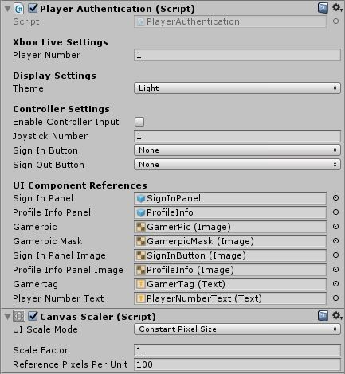

# Easy sign-in with the PlayerAuthentication prefab

The PlayerAuthentication prefab is the easiest way to add Xbox Live Authentication to your title.
It only takes three easy steps to go from a new scene to a sign-in page.

1. Drag the PlayerAuthentication prefab onto the scene.
2. Drag an XboxLiveServices prefab onto the scene.
3. Add an EventSystem to the scene. The PlayerAuthentication will create one for you if an EventSystem is not present, but adding it is a good habit.

You can now sign a player into XboxLive in your title by clicking on the PlayerAuthentication prefab in your scene.

Testing your scene in Unity by clicking the play button will cause your prefab to generate fake data, this is because the Unity player cannot connect to the Xbox Live service.
To see a real sign-in, build your project to run locally in Visual Studio.

If your title has been configured in Partner Center, and you have authorized a Microsoft account/gamertag to sign in to your title, you will be able to sign-in one of your authorized accounts in a Visual Studio build.

The PlayerAuthentication prefab's script has a few settings that you can manipulate from its view in the inspector:

| Setting | Description |
|---------|-------------|
| Player Number | Dictates the player that is linked to the sign-in panel. |
| Theme | Changes the color scheme for the sign-in panel for when a user is signed-in or signed out. This setting has a light or dark option. |
| Enable Controller Input | This checkbox allows for players to use an Xbox controller to sign-in and sign-out using the PlayerAuthentication prefab. |
| Joystick Number | Dictates the controller which can sign-in our out using the prefab. |
| Sign In Button | A drop-down which allows you to choose which button on an Xbox controller signs-in a user. |
| Sign Out Button | A drop-down which allows you to choose which button on an Xbox controller signs-out a user. |

## Multiplayer sign-in

In addition to single player sign-in, you can also use multiple PlayerAuthentication prefabs to implement local multiplayer on Xbox One console titles.
By adding multiple instances of the prefab and changing the Player Number attribute of each, you can sign-in multiple users to your title.

> [!WARNING]
> Signing-in multiple gamertags is not allowed on Windows 10 PCs. In order to sign in multiple users you will need to test your game on an Xbox One Console.

Creating a scene that allows multiplayer is only marginally more difficult using the PlayerAuthentication prefab:

1. Drag an instance of the PlayerAuthentication prefab onto the scene.

2. Check the **Enable Controller Input** box in the prefab's inspector.

3. Make sure that the **Player Number** and **Joystick Number** are set to 1.

4. Assign the **Sign In Button** from the drop-down menu.

5. Assign the **Sign Out Button** from the drop-down menu.

6. Drag a *second* instance of the PlayerAuthentication prefab onto the scene.

7. Check the **Enable Controller Input** box in the prefab's inspector.

8. Make sure that the **Player Number** and **Joystick Number** are set to 2.

9. Assign the **Sign In Button** from the drop-down menu.

10. Assign the **Sign Out Button** from the drop-down menu.

11. Drag an XboxLiveServices prefab onto the scene.

12. Add an EventSystem to the scene.

Check that the prefabs are working correctly by pressing Play in the Unity Player and clicking the prefabs.
They will return fake data, which is expected because the Unity Player cannot connect to Xbox Live.

With two instances of the PlayerAuthentication prefab configured to different players and joysticks, you are ready to build your game in Visual Studio so it can be properly tested on an Xbox Console.
Once your game is built, open the solution file in Visual Studio.

You will need to enable multi-user support for your game, as follows:

1. Search the Solution Explorer for the `package.appxmanifest.xml` file.

2. Right-click the file, and then click **View Code**.

3. In the `<Properties>` section, add the following line:

    `<uap:SupportedUsers>multiple<\/uap:SupportedUsers>`

4. Deploy the game to the Xbox console by starting a remote debugging build from Visual Studio.
   To set up your title on an Xbox console, see [Set up your UWP on Xbox development environment](https://docs.microsoft.com/windows/uwp/xbox-apps/development-environment-setup).

> [!NOTE]
> The piece of configuration changed may look like it is enabling multi-player but it is still necessary to run your game in single player scenarios.

Once you've got the PlayerAuthentication prefab working, you can learn more about scripting sign-in; see [Sign-In with the Sign-In manager in Unity](sign-in-manager.md).
