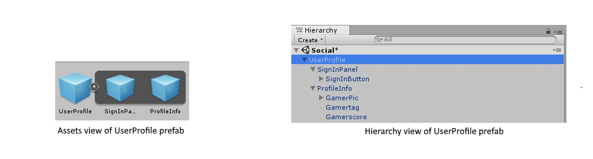
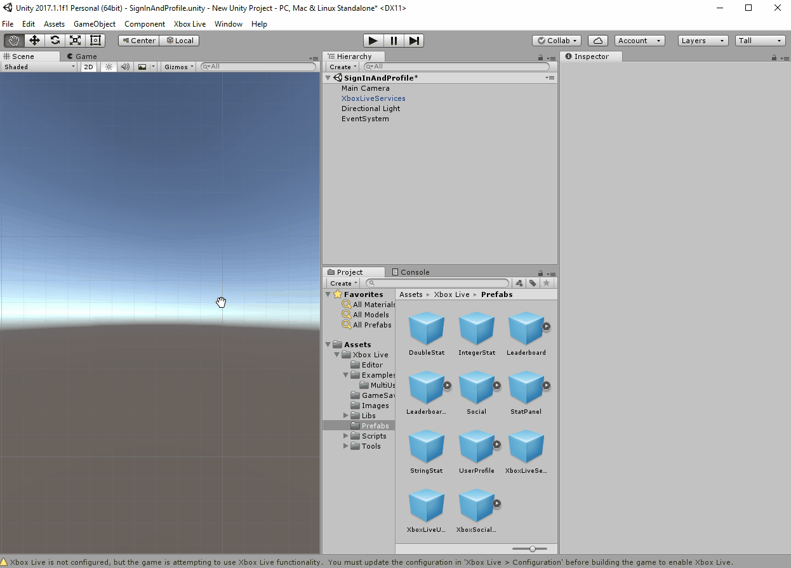
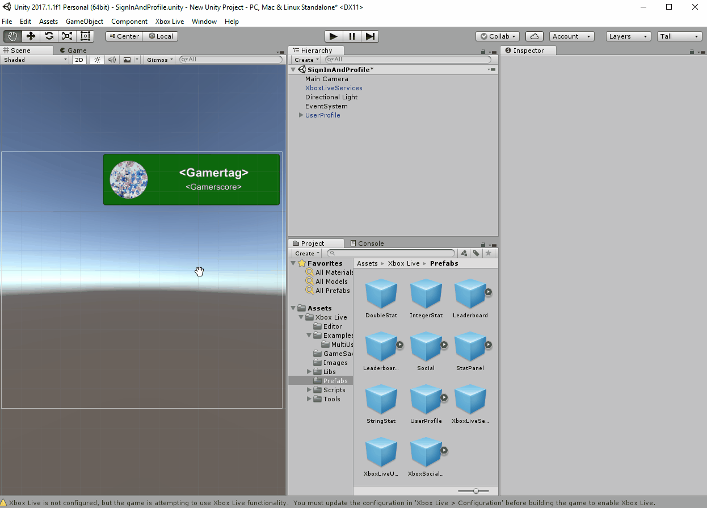
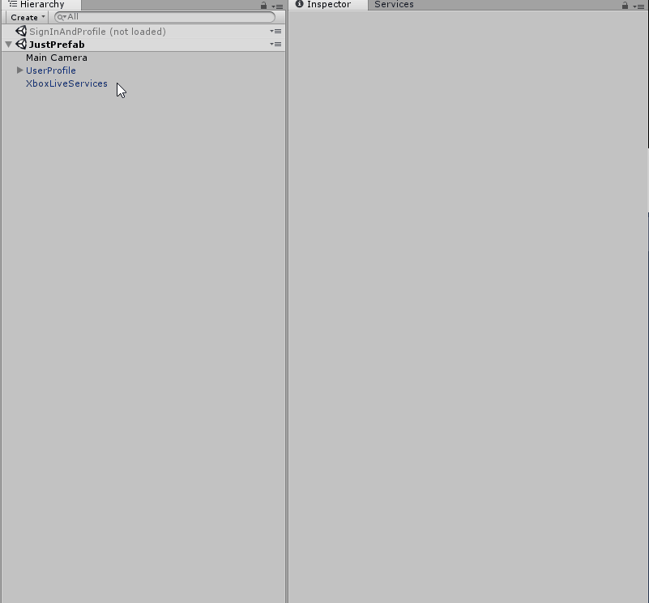
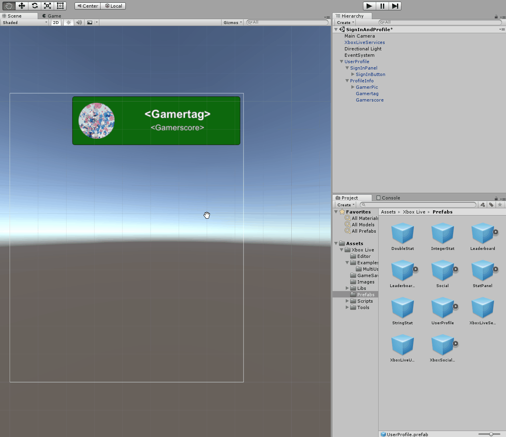

# Sign-in in Unity through prefabs or scripting (2017)

This article guides you through adding Xbox Live sign-in to your Unity projects.

There are two ways you can achieve sign-in, if you have downloaded the [Xbox Live Unity Plugin](https://github.com/Microsoft/xbox-live-unity-plugin):
* Use the prefabs contained within the plugin.
* Use the scripts and included libraries to script Xbox Live sign-in into your own custom GameObjects.

> [!IMPORTANT]
> This article applies to a version of the plugin prior to an update made in May 2018 (1804 Release).
If you installed the Xbox Live Plugin after that time, or have not yet downloaded it, you may have a newer version which has significant differences for how sign-in is performed.

In addition, the screenshots in this plugin do not match those of the most recent release.
For more up-to-date screenshots, see the two newer articles:
* [Easy sign-in with the PlayerAuthentication prefab (2018)](playerauthentication-prefab-sign-in.md)
* [Scripting Sign-In with the SignInManager in Unity (2018)](sign-in-manager.md)


## Before you begin

Before you start adding Xbox Live social services to your Unity game, there are a few preliminary steps.

1. First, make sure that you have downloaded and integrated the [Xbox Live Unity plugin](https://github.com/Microsoft/xbox-live-unity-plugin).

2. Second, you'll want to have your title reserved and published through the [Microsoft Development Center](https://developer.microsoft.com/en-us/games/uwp). Read [Create a new Xbox Live Creators Program title](../get-started-with-creators/create-and-test-a-new-creators-title.md) for instructions on publishing your title.

3. Finally, read [Configure Xbox Live in Unity](../get-started-with-creators/configure-xbox-live-in-unity.md) to set up your Unity environment properly and configure your title to use Xbox Live services.

Once your Unity project is set up properly, it's time to learn about the tools you can use in your Xbox Live enabled title, as well as the two main ways you can implement Xbox Live in Unity: prefabs and scripts.


## The Prefabs approach to sign-in

Unity has a prefab asset type that allows you to store a GameObject complete with components and properties.
The prefab acts as a template from which you can create new object instances in your Unity scene.
To learn more about prefabs, at the Unity website, see [Prefabs - Concept & Usage](https://unity3d.com/learn/tutorials/topics/interface-essentials/prefabs-concept-usage).

The Xbox Live Unity plugin provides a few prefabs that you can use in your project, to utilize Xbox Live features.
The prefabs that are described in this article enable you to do the following:
*  The **UserProfile** prefab enables sign-in.
*  The **XboxLiveUser** prefab is for [adding multi-user support](../get-started-with-creators/add-multi-user-support.md) to your title.
*  Display the friends list of a signed-in Xbox Live profile.

You can find these and other prefabs under the **Project** tab by following the path: **Assets > Xbox Live > Prefabs**.


### The UserProfile prefab, for sign-in

The first and most important social prefab is the **UserProfile** prefab.
The **UserProfile** prefab has everything required to allow an Xbox Live sign-in.

The **UserProfile** prefab is important, because you must sign-in a user before using Xbox Live services.
The **UserProfile** prefab contains both:
*  The sign-in button.
*  A `GameObject` to represent a logged-in player by their Gamertag, Gamerpic, and Gamerscore.

> [!NOTE]
> In order to use any of the other Xbox Live prefabs, you must include a **UserProfile** prefab or manually invoke the sign-in API.



The **UserProfile** prefab is what you will use to represent the information of any Xbox Live user signed-in locally to your title.
If you expand the **UserProfile** prefab in the **Project** panel or in the **hierarchy** after it’s been added to a scene, you’ll see that the **UserProfile** prefab contains two GameObjects inside of it:
* The **SignInPanel**, which contains the sign-in button experience.
* The **ProfileInfo**, which will contain the information about the user once they sign in.


### The XboxLiveUser prefab, for multi-user support

The **UserProfile** prefab (discussed above) uses a second social prefab in its code, called the **XboxLiveUser**.

The use of the **XboxLiveUser** prefab is not immediately evident, because it does not need to be added to the scene hierarchy, as it may simply be instantiated in code.
The **XboxLiveUser** has no visual representation; it simply contains the details that pertain to the Xbox Live user.

You will need an instance of the **XboxLiveUser** for every instance of the **UserProfile**.
This is important when [adding multi-user support](../get-started-with-creators/add-multi-user-support.md) to your title.

In addition to holding information about the user, after sign-in, the **XboxLiveUser** prefab is also a wrapper for the code used to sign-in an Xbox Live user.


## Sign-in with the UserProfile prefab

The Xbox Live Unity plugin prefabs exist to make certain development tasks much easier.
To enable Xbox Live sign-in for your Unity project you will simply need to use the **UserProfile** and **XboxLiveServices** prefabs along with a Unity **EventSystem**.

First, drag the **UserProfile** prefab into a scene.
Ideally the **UserProfile** should be placed on the initial menu screen of your project.



In addition to the **UserProfile** prefab, you will also need to make sure that the **XboxLiveServices** prefab is present in at least the first scene of your project.
The **XboxLiveServices** prefab allows you to toggle whether or not certain prefabs will log information for debugging.
This is useful for checking on prefab behavior.



Finally, the **UserProfile** also requires an **EventSystem** to run properly.
This can be added by right-clicking on the sign-in scene, then clicking through **GameObject --> UI --> EventSystem**.



If you enter play mode, the service will sign in a user automatically.
In Unity, the Xbox Live SDK simulates calls to the Xbox Live service and sends back fake data for you to work with.

In order to view live data, you will need to build the project as a UWP application and run it from Visual Studio; see [Configure Xbox Live in Unity](../get-started-with-creators/configure-xbox-live-in-unity.md).

When you enter play mode in Unity, the prefab will be populated with the fake data, which will simulate information such as the Gamertag, Gamerpic and Gamerscore of a player.
This is the information that should be displayed by the **UserProfile** prefab.

A successful sign-in looks like the following:


If you have not configured your project to connect to Xbox Live properly entering play mode will disable the sign-in button and display an error message.

The following is an example of a failed sign-in due to a bad Xbox Live app configuration:



## The scripting approach to sign-in

Now that you know how to use the **UserProfile** prefab, it would be best to look at the underlying script that governs the functionality of the prefab.
If you look at the **UserProfile** in the **Inspector**, you will see that it has a **UserProfile.cs** script attached to it.

The **UserProfile.cs** script has everything you need to sign in a user and load profile information you'd like to display on sign-in.

However, instead of looking at the entire prefab (which may be updated over time), we are going to look at a few sample lines of code to understand what is needed to sign-in an Xbox Live user.


### The XboxLiveUser class

The calls needed to sign-in a user are wrapped in the `XboxLiveUserInfo` class.
In the **UserProfile.cs** script you will see that there is an instance of the `XboxLiveUserInfo` class called `XboxLiveUser`.
We will use the same variable name in our example code.

The `XboxLiveUserInfo` class contains an instance of the `XboxLiveUser` class called `User` as one of its member variables.
The `XboxLiveUser` class contains the sign-in functions required to sign in the `XboxLiveUser`.

You will use the instance of the `XboxLiveUser` class `User` to sign-in users, as well as to gain information that describes the user, such as their Gamertag, Gamerpic, and Gamerscore.
In order to do this, you must initialize an instance of the `XboxLiveUserInfo` class and use the resulting `XboxLiveUserInfo.User` to call sign-in, as shown below.


### Initialize the XboxLiveUser

Initializing the Xbox Live User is the first step before actually signing them into Xbox Live.
This is done very simply in code by using the `XboxLiveUserInfo.Initialize()` function.

The following code uses the `XboxLiveUser` member variable as our `XboxLiveUserInfo` instance and initialize that to use for sign-in.

```csharp
    void ButtonClickTask()
    {
        this.StartCoroutine(this.InitializeXboxLiveUser());
    }

    public IEnumerator InitializeXboxLiveUserAndCallSignIn()
    {
        // Disable the sign-in button
        SignInButton.interactable = false;

        this.XboxLiveUser.Initialize();

        //Wait until the Xbox User has been initialized to call SignInAsync()
        yield return new WaitUntil(() => this.XboxLiveUser != null && this.XboxLiveUser.User != null);
        this.StartCoroutine(this.SignInAsync());
    }
```

Looking at this sample code, you will see that the `XboxLiveUserInfo.Initialize()` function is called in response to a button click.
The full **UserProfile.cs** prefab script has code that enables *automatic* sign-in, where `XboxLiveUserInfo.Initialize()` is called without user interaction.
The `XboxLiveUserInfo.Initialize()` function will create a new `XboxLiveUserInfo.User`, which enables calling the sign-in functions that are in the `XboxLiveUserInfo.User` class.


### Calling sign-in

Once the XboxLiveUser has been initialized, it's time to call sign-in.
In **UserProfile.cs** sign-in is called in the `SignInAsync()` function of **UserProfile.cs**.
In the previous example code, we simply wait for the `XboxLiveUser` to be initialized before calling the `SignInAsync()` function.

> [!NOTE]
> It is necessary to wait for the `XboxLiveUser` to be initialized before calling sign-in, because the `XboxLiveUser` contains the `XboxLiveUser.User` property which is used to call sign-in.

In **UserProfile.cs**, the `SignInAsync()` function contains two sign-in functions that may be used to sign-in the user:
* `XboxLiveUser.User.SignInSilentlyAsync()`
* `XboxLiveUser.User.SignInAsync()`

Those are the functions that sign the user in.
The `SignInAsync()` function is a good example of how to use these functions appropriately.

The following shows one approach for calling the two sign-in functions:

```csharp
SignInStatus signInStatus;
TaskYieldInstruction<SignInResult> signInSilentlyTask = this.XboxLiveUser.User.SignInSilentlyAsync().AsCoroutine();
yield return signInSilentlyTask;

signInStatus = signInSilentlyTask.Result.Status;
if (signInSilentlyTask.Result.Status != SignInStatus.Success)
{
    TaskYieldInstruction<SignInResult> signInTask = this.XboxLiveUser.User.SignInAsync().AsCoroutine();
    yield return signInTask;

    signInStatus = signInTask.Result.Status;
}
```

In this example, the results of the sign-in calls are stored in the variable `signInStatus`.
This allows us to check whether or not the sign-in was successful and act accordingly.

In this example, the function first attempts to sign-in silently, then if the silent sign-in fails, the function calls the normal sign-in function.

Once you have a successful call to one of the sign-in functions, you will have signed-in the user.
You can now use the `XboxLiveUser.User` to obtain and display details about the signed-in user.

To display information about a signed-in user by using `XboxLiveUser.User`, see the `LoadProfileInfo()` function in **UserProfile.cs**.


## Build and test sign-in

When running your title in the editor, you will see fake data when you try to use Xbox Live functionality.
To sign in with a real profile and test out Xbox Live functionality in your title, you'll need to build a UWP solution and run that solution in Visual Studio.

**To build the UWP project in Unity:**

1. Open the **Build Settings** window by selecting **File** > **Build Settings**.

2. Add all of the scenes that you want to include in your build under the **Scenes In Build** section.

3. Switch to the **Universal Windows Platform** by selecting **Universal Windows Platform** under **Platform** and clicking **Switch Platform**.

4. Set **SDK** to **10.0.15063.0** or greater.

5. To enable script debugging, check **Unity C# Projects**.

6. Click **Build**, and then specify the location of the project.

Once the build has finished, Unity will have generated a new UWP solution file, which you will need to run in Visual Studio:

1. In the folder that you specified, open **&lt;ProjectName&gt;.sln** in Visual Studio.

2. In the toolbar at the top, select **x64** and deploy to the **Local Machine**.

If you enabled **script debugging** when you built the UWP solution from Unity, your scripts will be located under the **Assembly-CSharp (Universal Windows)** project.

> [!NOTE]
> Before using your Visual Studio build to test your game with real data, follow the checklist in [Testing a Unity game build in Visual Studio](test-visual-studio-build.md), to help ensure that your title will be able to access the Xbox Live service.


## Troubleshooting

If you're having issues signing-in to Xbox Live, see [Troubleshooting Xbox Live sign-in](../using-xbox-live/troubleshooting/troubleshooting-sign-in.md).
