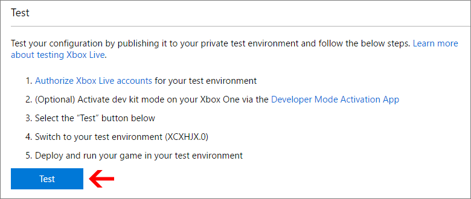

# Xbox Live service configuration for the Creators Program

## What is Service Configuration?

You may be familiar with some of the Xbox Live features such as [Leaderboards](../leaderboards-and-stats-2017/leaderboards.md) and [Connected Storage](../storage-platform/connected-storage/connected-storage-technical-overview.md).

In case you are not, we'll briefly explain Leaderboards as an example.
Leaderboards allow players to see a value representing an accomplishment, in comparison to other players.

For example, high scores in an arcade game, lap times in a racing game, or headshots in a first-person shooter.
But unlike an arcade machine, which only shows the top scores from the players who have played on that physical machine, with Xbox Live it is possible to display high scores from around the world.

But for this to happen, you need to perform some one-time configuration so that Xbox Live knows about your leaderboard.
For example, whether the values should be sorted in ascending or descending value, and what piece of data it should be sorting.

This configuration happens in [Partner Center](https://partner.microsoft.com/dashboard) for Xbox Live Creators Program, and you can read [Getting Started With Xbox Live](get-started-with-xbox-live-creators.md) to learn how to get set up.

## Get your IDs

To enable Xbox Live services, you will need to obtain several IDs to configure your development environment and title.
These can be obtained by updating your Xbox Live service configuration.

If you do not currently have a title in Partner Center, see [Create and test a new Creators title](create-and-test-a-new-creators-title.md) for guidance.

### Critical IDs

There are three IDs which are critical for development of titles and applications for Xbox One:
* The Sandbox ID
* The Title ID
* The service configuration ID (SCID).

It is necessary to have a Sandbox ID to set up your development environment.
The Title ID and SCID are not required for initial development, but are required for any use of Xbox Live services.
We therefore recommend that you obtain all three IDs at once.

You can view all of these IDs on the "Xbox Live" root configuration page, as shown below:

#### Sandbox IDs

The sandbox provides content isolation for your environment during development, ensuring that it is clean for developing and testing your title.
The Sandbox ID identifies your sandbox.
A console may only access one sandbox at any one time, though one sandbox may be accessed by multiple consoles.

Sandbox IDs are case sensitive.

#### Service Configuration ID (SCID)

As a part of development, you will create stats, leaderboards and a host of other online features.
These are all part of your service configuration, and require the SCID for access.
SCIDs are case-sensitive.

#### Title ID

The Title ID uniquely identifies your title to Xbox Live services.
It is used throughout the services to enable your users to access your title's Live content, their user statistics, achievements, and so forth, and to enable Live multiplayer functionality.

Title IDs can be case sensitive, depending on how and where they are used.

## Publish your Xbox Live service configuration

When you make changes to the Xbox Live configuration for your game, you need to publish the changes before they are picked up by the rest of Xbox Live and can be seen by your game.
When you are still working on your game, you publish to your own development sandbox.
The development sandbox allows you to work on changes to your game in an isolated environment.

When your game is released to the public, the Xbox Live configuration will automatically be published to the RETAIL sandbox.
By default, Xbox One Consoles and Windows 10 PCs are in the RETAIL sandbox.

On the Xbox Live configuration page, click the **Test** button to publish the current Xbox Live configuration to your development sandbox.

