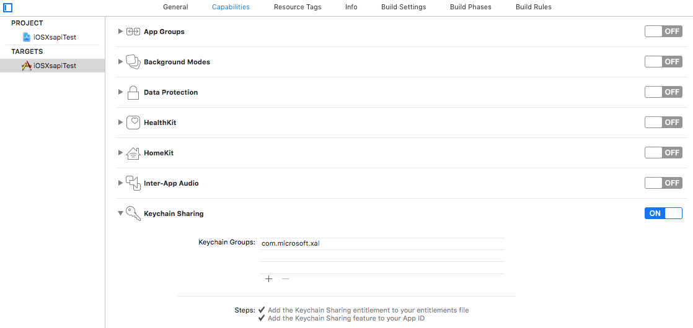

# Get started with the Xbox Live SDK for iOS
Use Xbox Live to connect all games across devices to play together.

## Add the Xbox Live SDK for iOS to your project
Xbox Live SDK for iOS contains 4 components as "frameworks" that you can reference in your game.

- HttpClient.framework
- Xal.framework
- Xsapi-c.framework
- XSAPITCUI.framework

To use Xbox Live SDK for iOS in your game:

1. Download the Xbox Live SDK for iOS to your development machine.
1. Add all 4 frameworks to your Xcode workspace.
    1. Create a **Frameworks** group inside your project if one does not exist.
    1. Right click the **Frameworks** group, select **Add Files to "{Your Project}"**
    1. Navigate to the directory containing the Xbox Live SDK for iOS, and select all 3 frameworks (libHttpClient.framework, Xal.framework, and Xsapi-c.framework)
        - Check "Copy items if needed"
        - Select "Create foldre references"
    1. Update Build Settings
    1.   Under the **General** tab => **Embedded Binaries**, add all 4 frameworks
1. Navigate to the **Keychain Sharing** section of your project's **Capabilities**, then add the following keychain group to the list:
    ** `com.microsoft.xal`**
    
