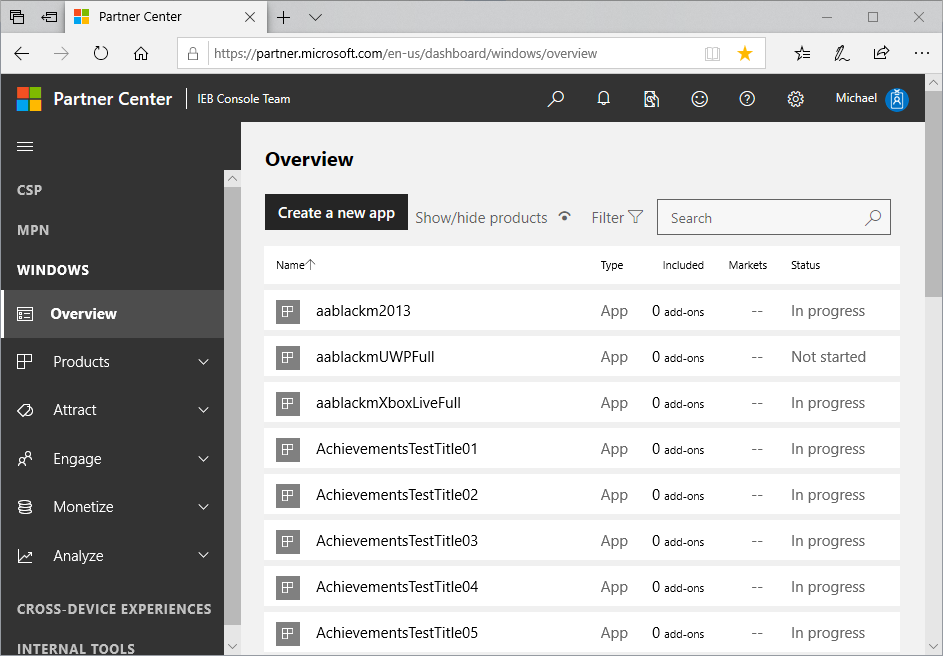
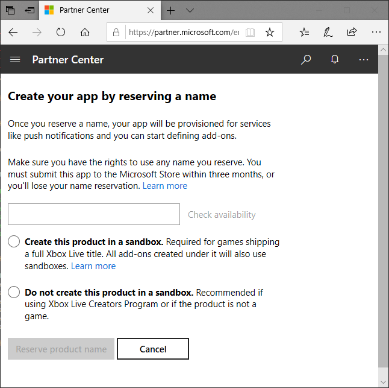
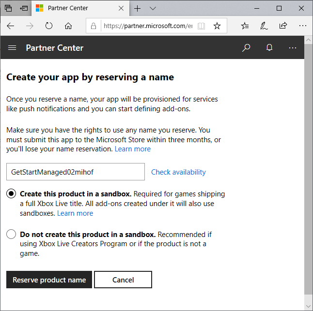
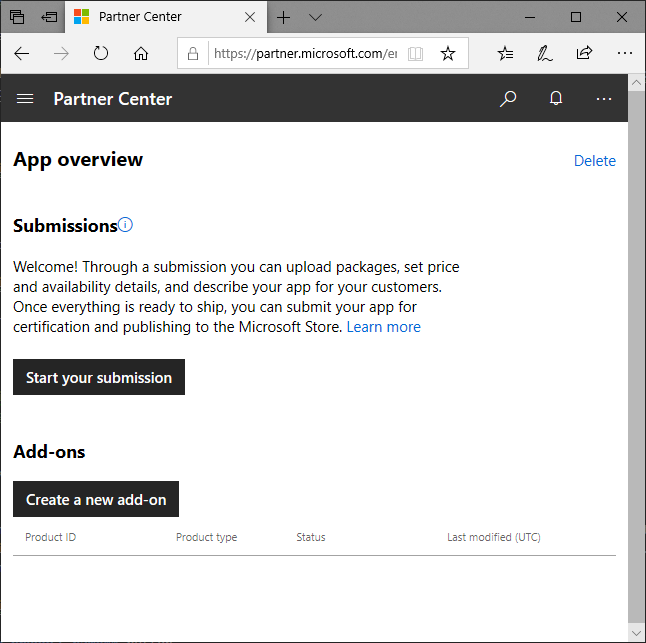
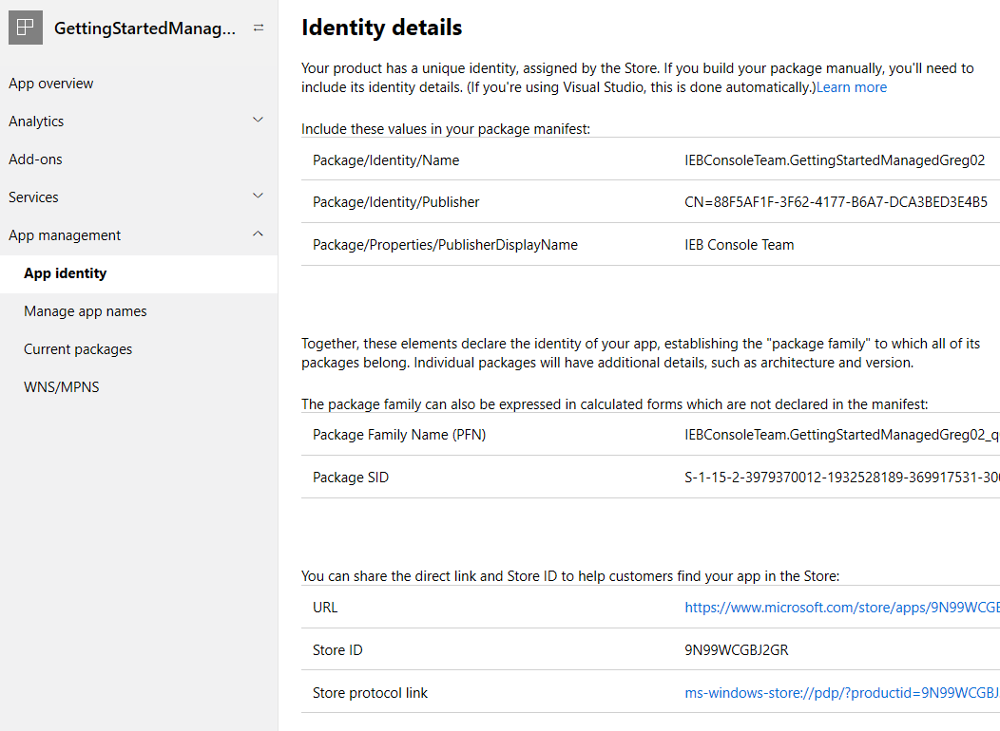
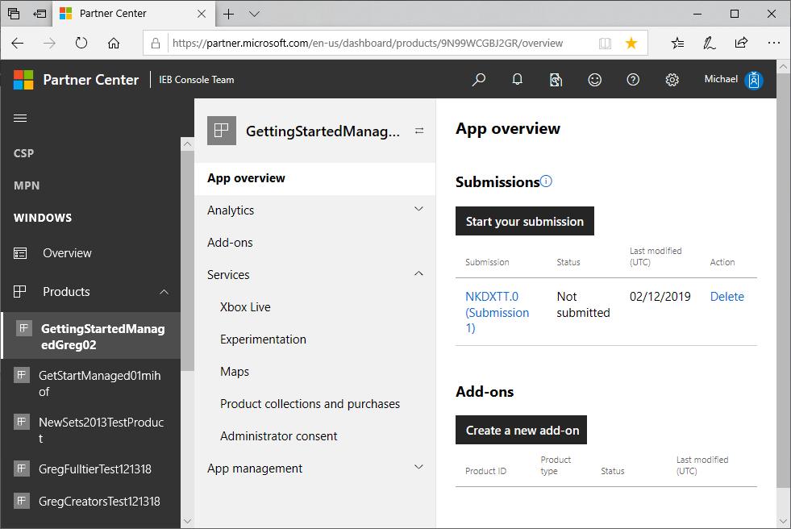
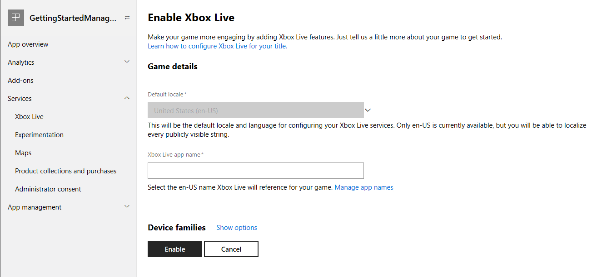
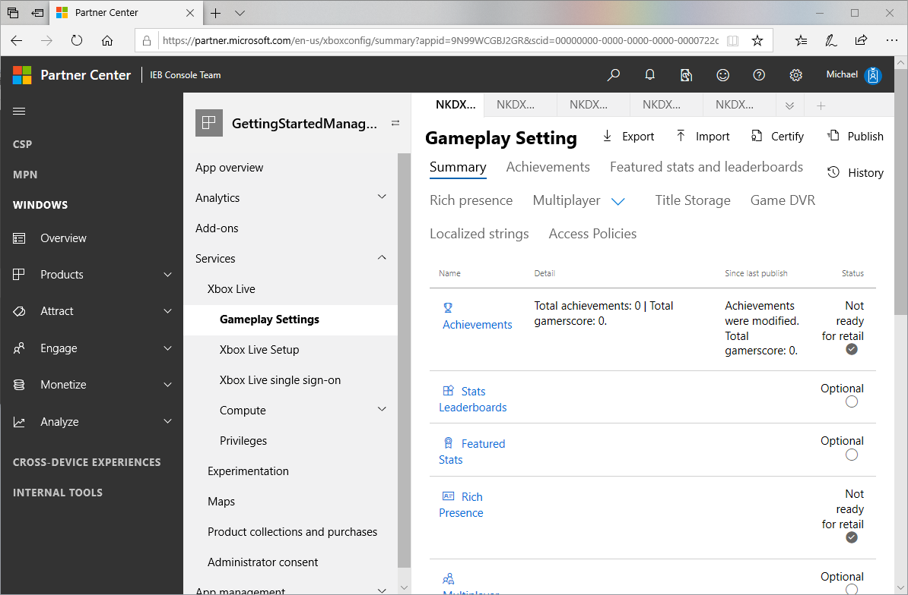
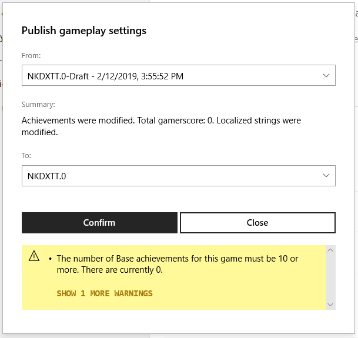
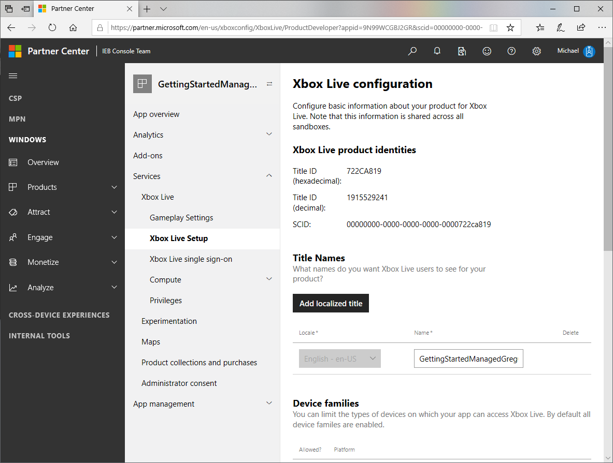

# Setting up a game at Partner Center

<!--todo: open external links in new tab-->

To add Xbox Live functionality to your game, start by setting up an app in Partner Center, as follows.

This procedure is for the Creators program.
If you are an ID@Xbox partner, see [Getting started, for ID@Xbox partners](../id-partners/index.md).

<!--===========================================================-->
## 1. Create a new app

Next, at Partner Center, create a new app, as follows.

1. Right-click the following link and then click **Open in new window**: [Partner Center dashboard](https://partner.microsoft.com/dashboard/).

   The Partner Center dashboard appears, showing the "Overview" page, within the "WINDOWS" section.

   

2. Click the **Create a new app** button.

   The page "Create your app by reserving a name" appears.

   

3. In the text box, enter the name of your product.
   You can change the name later.

4. Click the check box **Create this product in a sandbox**.

   > [!IMPORTANT]
   > For Managed Partners and ID@Xbox developers, to enable Xbox Live functionality, you **MUST** select the option button **Create this product in a sandbox**, the first time through this process.
   > You won't be able to select this option button later.
   > (Do not select the check box "Do not create this product in a sandbox".)

   

5. Click the **Reserve product name** button.

   The "App overview" page appears.

   

6. Click the **Start your submission** button.

   The "Start your submission" dialog box appears.

   

7. In the "Select the sandbox..." combo field, click the down-arrow on the right, then click a sandbox; for example, "NKDXTT.0 (shared)".

8. Click the **Create submission** button.
 
   After a delay, the submission page appears, showing the name of the sandbox and the submission number; for example, "NKDXTT.0 (Submission 1)".

<!--===========================================================-->
## 2. Contact your Microsoft Representative to enable your game

tbd: delete section?

<!-- UI steps? correct capture?-->

<!-- In the middle column, select Services: Xbox Live: Xbox Live Setup.-->

1. In Partner Center, select your game.  

   The "App overview" page appears.

2. Click **App management**: **App identity**.

   The "Identity details" page appears.

   

3. Copy the **Store ID**.

4. Contact your Microsoft representative to ask them to add Xbox Live capability to your title.
   Include the store ID.
   For example:

   * **Subject**: Need to enable game for Xbox Live

   * **Body**: "Hi support, I would like to enable my Partner Center product.  The store ID is [your game's store ID]."

   Your Microsoft representative emails you; for example: "Your game has been Xbox Live-enabled.  You are now able to enable your product in Partner Center."

<!--===========================================================-->
## 3. Enable Xbox Live for the game

<!-- todo: closing browser will cause to lose their place in this doc. tell how to return here. -->

When you receive the above email from your MS Representative, continue with the following steps.

   > [!IMPORTANT]
   > First, close the browser, including all of the browser's window instances, to clear the session cache.
   > Then open a new browser.

1. Go to Partner Center.
   To do this, you can right-click the following link and then click **Open in new window**: [Partner Center dashboard](https://partner.microsoft.com/dashboard/).

2. Click **Products**, and then click your game.

   The "App overview" page appears.

   

3. Under **Services**, click **Xbox Live**.

   The "Enable Xbox Live" page appears, this first time only.

   

4. In the "Xbox Live app name" text box, enter the name of your game.
   You can use the same name as shown at the top of the page, but it doesn't need to be the same.

5. Click the **Enable** button.  

   Below the "Enable" button, a message temporarily appears:
   "Your product is being Xbox Live enabled.  This may take a few minutes."

   After some time, the Xbox Live "Gameplay Setting" page automatically appears.
   
   

<!--===========================================================-->
## 4. Publish the game

In Partner Center, with your game selected as in the above procedures, do the following.

1. In the top right, click the **Publish** link.

   The "Publish gameplay settings" dialog box appears.

   

2. Click the **Confirm** button.

   At the bottom of the dialog box, the message appears: "Publishing configuration..." and then "Publishing configuration finished successfully."
   The game is actually published after a delay of possibly 20 minutes.

3. Click the **Close** button.

   The "Publish gameplay settings" dialog box closes, and the "Gameplay Setting" page remains displayed.

The SDK can now be used in an application to sign-in.

Next, find the ID of your game, as follows.

<!--===========================================================-->
## Find your Xbox Live game information

In Partner Center, with your game selected as in the above procedures, do the following.

1. Click **Service**: **Xbox Live**: **Xbox Live Setup**.

   The "Xbox Live configuration" page appears.

   

2. Copy and save the title ID value for later.

<!--===========================================================-->
## 5. Create a Test Account

TBD

<!--===========================================================-->
## Next step

[Setting up an IDE for Xbox Live](set-up-ide/index.md)

<!--===========================================================-->
## See also

[Partner Center Xbox Live configuration Summary page](../../configure-xbl/dev-center/summary.md)
