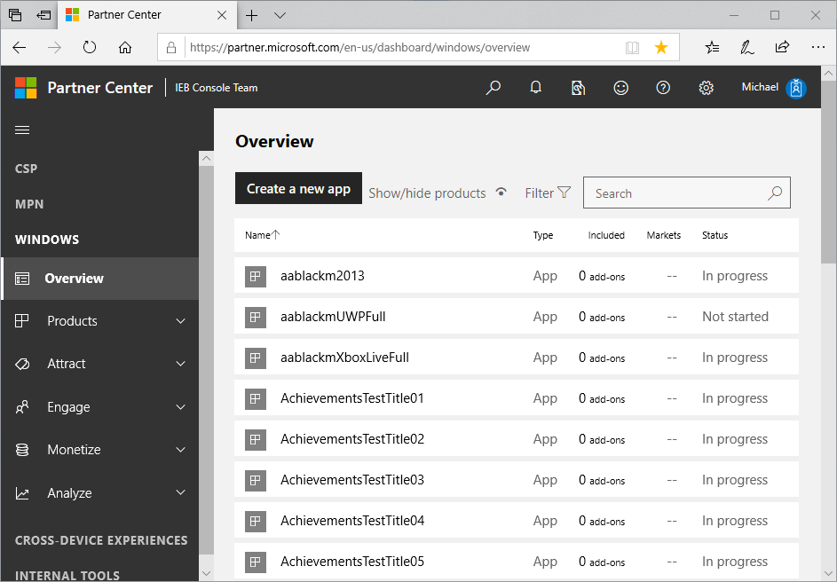
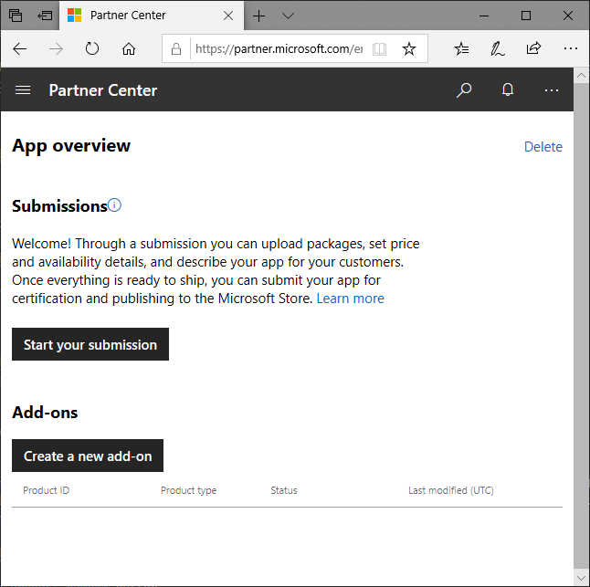
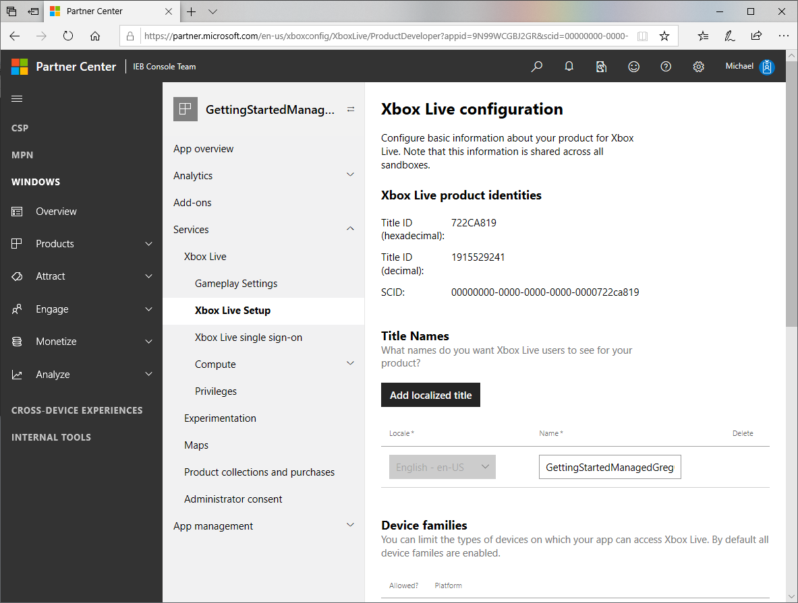
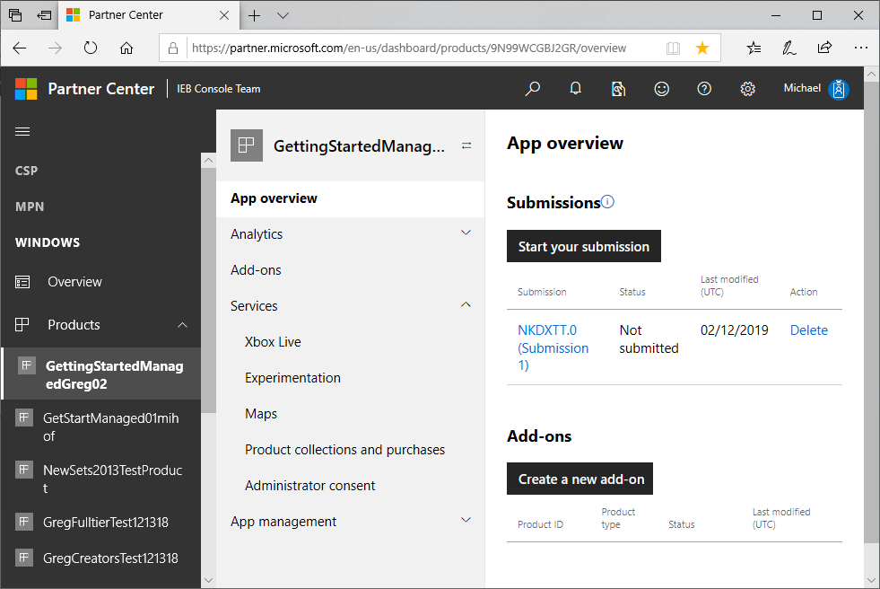
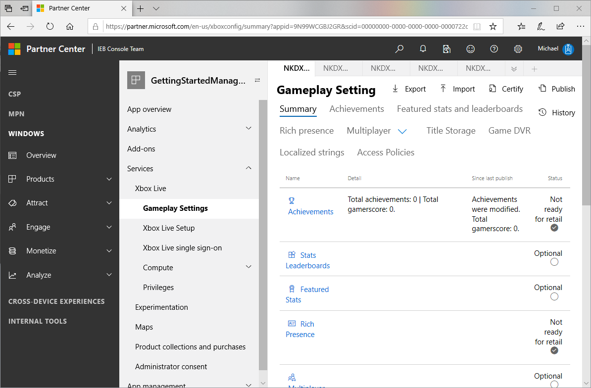

# Getting started, for ID\@Xbox or Managed Partners

To add Xbox Live functionality to your game, start here.

This page is for members of the ID@Xbox or Managed Partners program.
If you are in the Creators program, see [Getting started, for Creators](getstart-creators.md).

<!--todo: open external links in new tab-->

## Prerequisite: Set up a Partner Center account

<!--
what about MPs?
shorten step 3?
-->

1. Prepare a prototype of your game, such as a demo and screen captures.

2. For ID@Xbox partners: If you aren't already an ID@Xbox partner, apply to the ID@Xbox program.
   To do this, right-click the following link and then click **Open in new window**: [Welcome to ID@Xbox](https://www.xbox.com/developers/id).
   Follow the instructions at that site, and then continue with the steps below.

3. If you don't have a Partner Center account yet, Microsoft helps you set up your Partner Center account.
   To create a Partner Center account, right-click the following link and then click **Open in new window**:
   [Partner Center documentation site: Create a Partner Center account](https://docs.microsoft.com/en-us/partner-center/mpn-create-a-partner-center-account).
   Follow the instructions at that site, and then continue with the steps below.

<!--===========================================================-->
## 1. Create a new app

Next, at Partner Center, create a new app, as follows.

1. Right-click the following link and then click **Open in new window**: [Partner Center dashboard](https://partner.microsoft.com/dashboard/).

   The Partner Center dashboard appears, showing the "Overview" page, within the "WINDOWS" section.

   

2. Click the **Create a new app** button.

   The page "Create your app by reserving a name" appears.

   

3. In the text box, enter the name of your product.
   You can change the name later.

4. Click the check box **Create this product in a sandbox**.

   > [!IMPORTANT]
   > For Managed Partners and ID@Xbox developers, to enable Xbox Live functionality, you **MUST** select the option button **Create this product in a sandbox**, the first time through this process.
   > You won't be able to select this option button later.
   > (Do not select the check box "Do not create this product in a sandbox".)

   

5. Click the **Reserve product name** button.

   The "App overview" page appears.

   

6. Click the **Start your submission** button.

   The "Start your submission" dialog box appears.

   

7. In the "Select the sandbox..." combo field, click the down-arrow on the right, then click a sandbox; for example, "NKDXTT.0 (shared)".

8. Click the **Create submission** button.
 
   After a delay, the submission page appears, showing the name of the sandbox and the submission number; for example, "NKDXTT.0 (Submission 1)".

<!--===========================================================-->
## 2. Contact your Microsoft Representative to enable your game

<!-- UI steps? correct capture?-->

1. In Partner Center, select your game. In the middle column, select Services: Xbox Live: Xbox Live Setup.

   The "Xbox Live configuration" page appears.

   

2. Select and copy the **SCID** value.
   This is the Store ID.

3. Contact your Microsoft representative to ask them to add Xbox Live capability to your title.
   Include the store ID (the SCID value).

<!--===========================================================-->
## 3. Enable Xbox Live for the game

When you receive a response from your MS Representative, saying that your game has been Xbox Live-enabled, continue with the following steps.

<!-- todo: this will cause to lose their place in this doc -->

1. Close the browser, including all of the browser's window instances, to clear the session cache.
 
2. Open the browser.

3. Go to the Partner Center.

4. In Partner Center dashboard, click **Products**, then click your game.

   <!-- todo: Watch the February 12, 2019 Teams video here, to extract the UI actions/results. -->
   The first time you do this for a game, the "Game Setup" page appears.

   <!--todo: capture-->

5. Click the option button **Use full Xbox Live feature set (requires concept approval)**.

   The "App overview" page appears.

   

   Under "Services", "Xbox Live" now appears.

   The "Enable Xbox Live" page appears. <!--after you click what?-->
   The "Enable Xbox Live" page appears only the first time you click __ <!--what?--> above.

6. In the __ page, in the __ control, enter the name of the product, using the same name as before.

7. Click the "Enable" button.

   The "Gameplay Setting" page appears.

   

<!--===========================================================-->
## 4. Publish the game

In Partner Center, with your game selected as in the above procedures, do the following.

1. In the top right, click the **Publish** link.

   The "Publish gameplay settings" dialog box appears.

   

2. Click the **Confirm** button.

   At the bottom of the dialog box, the message appears: "Publishing configuration finished successfully."
   The game is actually published after a delay of possibly 20 minutes.

3. Click the **Close** button.

   The "Publish gameplay settings" dialog box closes, and the "Gameplay Setting" page remains displayed.

The SDK can now be used in an application to sign-in.

<!--===========================================================-->
## 5. Create a Test Account

TBD

<!--===========================================================-->
## 6. Get the Android sign-in sample (move into separate article)

TBD
~~

How to add sign-in capability to your app.

API

drag-and-drop

1 async method call, depending on platform.  For mobile, signin is not as simple as before. 

Android Studio

<!--
setup related:
https://review.docs.microsoft.com/en-us/gaming/xbox-live/get-started-with-partner/partner-add-xbox-live-to-unity-uwp?branch=getstart-master
https://review.docs.microsoft.com/en-us/gaming/xbox-live/get-started-with-partner/xdk-developers?branch=getstart-master
-->

<!--===========================================================-->
## 7. Sign in (move into separate article)

TBD

<!--===========================================================-->
## Background information about configuring a game (relevant where?)

There are two areas, which are configured through different means:
*  Configuration of services, including server ingestion of information about your game.
*  Your executable ("the client"), including packages.

Enhanced Resource Access (ERA) is a type of package.
For example, for game code such as the Sign-in sample for Android (discussed in a later step), you package the game code to run on Android hardware; compiling it for that hardware.
An ERA package runs on the Xbox One console.

In contrast, a UWP package has less performance optimization, but can run on both Xbox and Windows without writing as much code.

The marketing page for your game is generated based on the metadata in the categories listed under "Product":
* Name/Type
* Store Rating
* Store Listing (markets)
* Store Metadata
* Packages
* Xbox Live

<!--===========================================================-->
## Platforms (move into separate article)

Supported package types for each platform:
* Xbox One supports and ERA, UWP packages.
* The PC supports Win32, UWP, and eventually MSIXVC packages.
* Android
* iOS

<!--===========================================================-->
## Next steps

TBD

<!--===========================================================-->
## See also

[Partner Center Xbox Live configuration Summary page](../configure-xbl/dev-center/summary.md)
