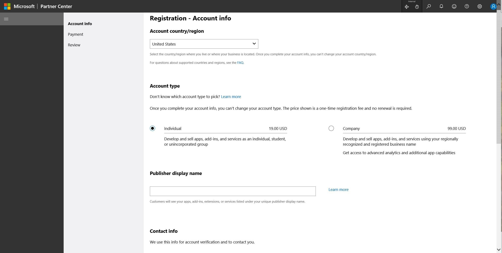
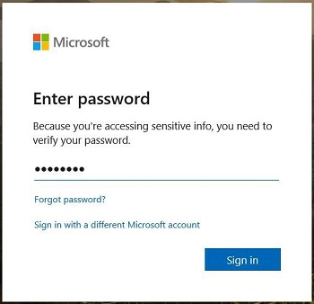

# Joining the Creators Program

To join the Xbox Live Creators Program:

1. Go to <a href="https://www.xbox.com/en-US/developers/creators-program" target="_blank">Xbox Live Creators Program &#11008;</a>. The "Xbox Live Creators Program" page appears in a new tab.

   1. Near the top of the page, click the **CREATE A DEV ACCOUNT** button. The "Get registered" page appears in a new tab.

   1. Click the **SIGN UP** button.

   1. Follow the dialog boxes to create a new Creators account for use at Partner Center. The "Registration - Account info" page appears, in Partner Center:
   
   

2. In the **Account country/region** drop-down list, pick a country.

   Additional sections are added to the page:

   

3. Fill-in the **Account type**, **Publisher display name**, and **Contact info** sections, and then click the **Next** button.

   An "Enter password" dialog box appears in a new tab:

   

4. Enter the password for the new account, and then click the **Sign in** button.

   The "Registration - Payment" page appears in Partner Center:

   

5. If you have a promo code, enter it in the **Promo code** field. Otherwise, in the **Billing** section, click **Add a new payment method**. Then click the **Next** or **Save** button.

   The "Review" page appears.

6. Review the settings, and then click the **Next** or **Save** button.

7. Click the **Finish** button.

## Next steps

Next, set up a game at Partner Center; see [Getting Started](../live-getstarted-nav.md).
