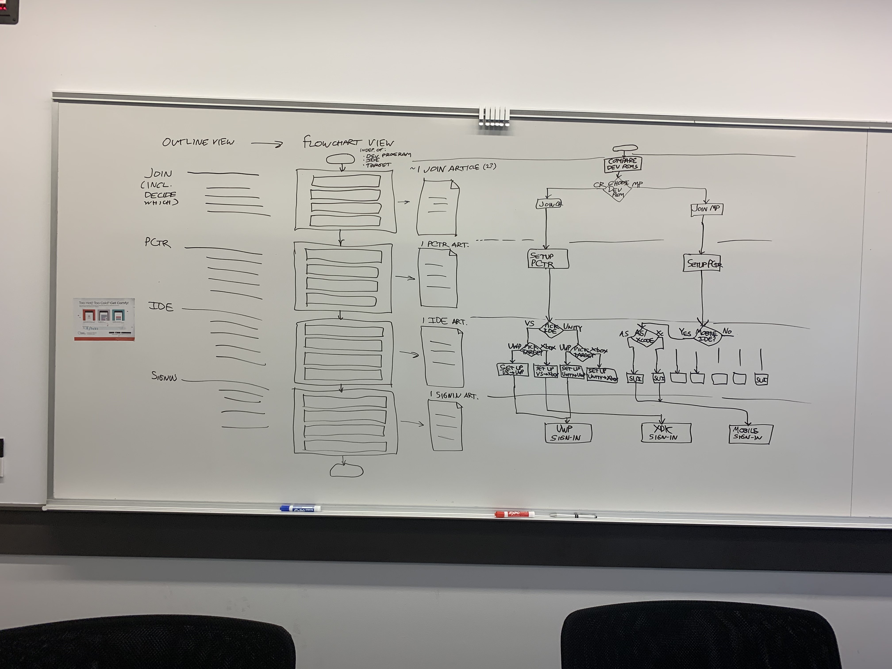

# Onboarding flow diagram

## Top-level steps

The following are the top-level steps to start adding Xbox Live functionality to your game, regardless of which Xbox Live developer program you join, which IDE you set up, and which platforms you target.

   

To start adding Xbox Live to your game, you follow a series of 5 onboarding articles:

1. One article about choosing which Xbox Live developer program to join.
   There is only 1 version of this article.

2. One article about actually joining an Xbox Live developer program.
   There are 2 versions of this article: one for Creators, and one for ID@Xbox Managed Partners.

3. One article about creating a new game app in Partner Center and noting its IDs.
   There are 2 versions of this article: one for Creators, and one for ID@Xbox Managed Partners.

4. One article about setting up an IDE to use the Xbox Live SDK.
   There is a version of this article for each combination of IDE and target platform.

5. One article about adding basic sign-in code, for the game to sign-in to Xbox Live services.
   There are 3 versions of this article, based on which platform you target: Mobile (Android and iOS), UWP, and XDK.

The end result of following this Xbox Live onboarding flow is that you have one IDE set up to call the Xbox Services API from one target platform, and your game running on that platform has done basic sign-in to Xbox Live.

## Branching paths

The following are all of the possible onboarding flow paths to start adding Xbox Live functionality to your game, reflecting which Xbox Live developer program you join, which IDE you set up, and which platform you target.

   

   
