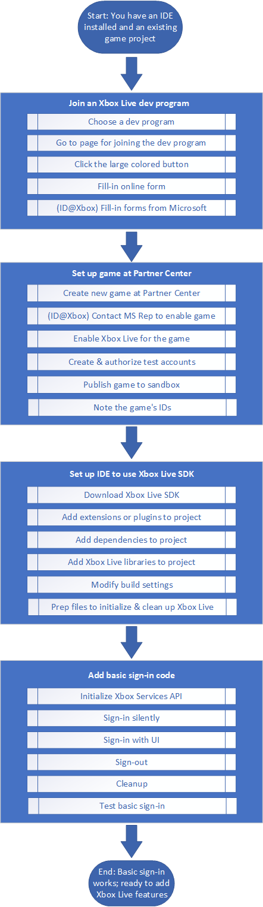

# Onboarding flowchart

The following are the top-level steps to start adding Xbox Live functionality to your game.

   

## The series of articles to follow

To start adding Xbox Live to your game, follow this series of onboarding articles:

1. Read the article about choosing which Xbox Live developer program to join: the Xbox Live Creators Program or the ID@Xbox Managed Partners Program.
   Then read the article about joining that Xbox Live developer program.

2. Read one of the articles about creating a new game app in Partner Center - either as a Creator or as an ID@Xbox Managed Partner.

3. Read the article about setting up a particular IDE to use the Xbox Live SDK, targeting a particular platform.
   <!-- There is a version of this article for each combination of IDE and target platform, for each developer program. -->

4. Read the article about adding basic sign-in code for your target platform, in order for the game to sign-in to Xbox Live.
   <!-- There are several versions of this article, based on which platform you target: Mobile (Android or iOS), Windows 10, and Xbox. -->

The end result of following this Xbox Live onboarding flow is the following:
* Your IDE is set up to call the Xbox Services API from your target platform.
* Your game has done basic sign-in to Xbox Live.
* Your game is ready to add other Xbox Live features, by configuring Xbox Live features at Partner Center and calling the Xbox Services API.
