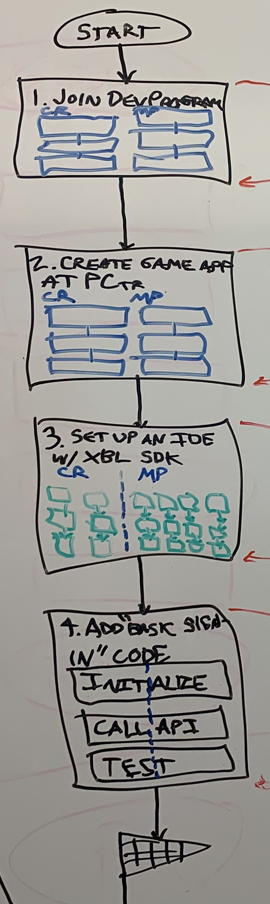
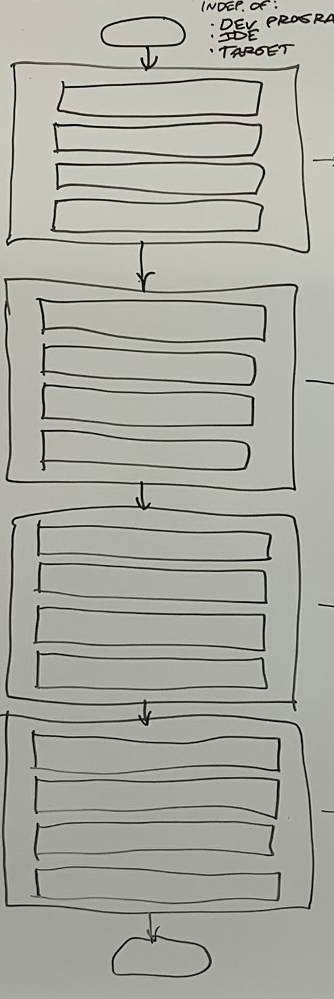

# Onboarding flow diagrams

## Top-level steps

The following are the top-level steps to start adding Xbox Live functionality to your game, regardless of which Xbox Live developer program you join, which IDE you set up, and which platforms you target.

   
   

### Text to move into the above diagram

1. Joining a Dev Program
   1. Go to the external welcome page for joining the dev program.
   2. Click the large colored button.
   3. Fill-in the online form and submit it.
   4. ID@Xbox Managed Partners: Fill-in the forms emailed from Microsoft.

2. Set up a new game app at Partner Center
    1. Create new game app at Partner Center.
    2. ID@Xbox Managed Partners: Contact Microsoft Rep to enable game.
    3. Enable Xbox Live for the game.
    4. Create & authorize test accounts.
    5. Publish game to sandbox.
    6. Note the game's IDs.

3. Set up IDE (such as Android Studio here) to use Xbox Live SDK
    1. Download the Xbox Live SDK.
    2. Add extensions or plugins to the project.
    3. Add dependencies to the project.
    4. Add Xbox Live libraries to the project.
    5. Modify the build settings.
    6. Prepare files to initialize and cleanup Xbox Live.

4. Add basic sign-in code
    1. Initialize XSAPI.
    2. If mobile, initialize XAL.
    3. Basic Sign-In/Sign-Out.
    4. Cleanup.
    5. Test basic sign-in.

## The series of articles to follow

To start adding Xbox Live to your game, you follow a series of onboarding articles:

1. The article about choosing which Xbox Live developer program to join, and one of the articles about actually joining an Xbox Live developer program (to join either the Creators or ID@Xbox Managed Partners Program).

2. One of the articles about creating a new game app in Partner Center and noting its IDs - either as a Creator or as an ID@Xbox Managed Partner.

3. An article about setting up an IDE to use the Xbox Live SDK.
   <!-- There is a version of this article for each combination of IDE and target platform, for each developer program. -->

4. An article about adding basic sign-in code, for the game to sign-in to Xbox Live services.
   <!-- There are several versions of this article, based on which platform you target: Mobile (Android or iOS), Windows 10, and Xbox. -->

The end result of following this Xbox Live onboarding flow is that you have a single IDE set up to call the Xbox Services API from a single target platform, and your game running on that platform has done basic sign-in to Xbox Live.
