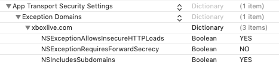

# Setting up Xcode targeting iOS

Follow the steps in this article, in the order shown, to set up Xcode targeting iOS to use the Xbox Live SDK, for Managed Partners.
Afterwards, you'll be ready to follow the article about adding basic sign-in code for Xbox Live services.
Then you'll be able to call other Xbox Services API (XSAPI) functions.


## Prerequisite steps

* Ensure you have a iOS project created in Xcode, set up to handle Objective-C.
  If your project is written in pure Swift, you will need to set up Objective-C interoperability.


## Download the Xbox Live SDK

Download the Xbox Live SDK for iOS to your local computer.

<!-- todo: need URL for iOS SDK -->


<!-- ## Add extensions to the project -->


<!-- ## Add dependencies to the project -->


## Add Xbox Live libraries to the project

Add the 3 XBL iOS frameworks to your project, as follows.

1. Under **Project Settings**, select the **General** tab, scroll down to **Embedded Binaries**, and then click the **+** button.

   <!-- The __ dialog box|page|screen|window appears. -->

   A dialog box appears.

2. Click the **Add Other...** button.

   <!-- The __ dialog box|page|screen|window appears. -->

3. Navigate to the **Xbox Live SDK** directory, select the Debug (or Release) version of the following libraries, which comprise the iOS Xbox Live SDK:
    - HttpClient.framework
    - Xal.framework
    - Xsapi-c.framework

4. Click the **Open** button.

   <!-- The __ dialog box|page|screen|window appears. -->

5. Select the **Copy items if needed** check box and the **Create folder references** check box, and then click the **Finish** button.

   A copy of the frameworks is added to the project, and the frameworks are embedded in the project build setup.


## Modify the build settings

1. Under **Project Settings**, <!--where? describe the UI controls more explicitly - where are we: what app? what menu? what pane?--> click the **Capabilities** tab.

   <!-- The __ dialog box|page|screen|window appears. -->

2. Enable **Keychain Sharing**. <!-- Click the **Keychain Sharing** check box so that a checkmark appears.-->

3. Under **Keychain Sharing**, <!--Below the Keychain Sharing checkbox,?  In the Keychain Sharing section,?--> in the **Keychain Groups** section, add `com.microsoft.xal`.

4. Under **Project Settings**, <!--where? describe the UI controls more explicitly - where are we: what app? what menu? what pane?--> click the **Info** tab.

5. Under **URL Types**, <!--Below the URL Types check box,? In the URL Types section,?--> click the **+** button to add an entry.

6. Click the **General** tab, and then note your app's bundle ID.

<!-- 
Not bundlename+.xalAuth?
From get-started-with-ios-android/ios-get-started-with-xsapi.md : 
1. For the **Identifier** field, enter: &lt;Your app's bundle name&gt;`.xalAuth`
-->

7. Click the **Identifier** UI control<!--what kind of UI control is that?-->, and then add the bundle ID of your app.

8. In the **URL Schemes** box, add `ms-xal-` followed by Microsoft Partner Client ID.
   For example, for the sample app, <!--which sample app? what's the name or distinguishing description of this app?--> the Microsoft Partner Client ID is "ms-xal-000000004824156C".

9. Under **Project Settings**, <!--where? describe the UI controls more explicitly - where are we: what app? what menu? what pane?--> click the **Build Settings** tab.

10. Search <!--clarify: do what action on which UI controls?--> for "Preprocessor Macros", and add "XSAPI_C=1" and "XSAPI_I=1" to each build configuration.
    If you are using cross-platform code, you can check for the "XSAPI_I" macro, to wall-off iOS-specific code.

11. Find <!--where? in which UI controls?--> the `Info.plist` file for your project, and open it in a text editor.

12. In the root dictionary, add the following settings:

```xml
<key>NSAppTransportSecurity</key>
<dict>
    <key>NSExceptionDomains</key>
    <dict>
        <key>xboxlive.com</key>
        <dict>
            <key>NSExceptionAllowsInsecureHTTPLoads</key>
            <true/>
            <key>NSExceptionRequiresForwardSecrecy</key>
            <false/>
            <key>NSIncludesSubdomains</key>
            <true/>
        </dict>
    </dict>
</dict>
```

13. In Xcode, open the `Info.plist` file. <!--what kind of view is this? what kind of UI controls - a pane|section, where?-->

    The <!--**App Transport Security Settings**? what is the context in the UI display?--> section should look like the following:
    
    
    

<!-- ## Prepare native files to initialize and cleanup Xbox Live -->


## Bind C++ to the native environment

The code in the Xbox Live SDK uses Microsoft's SAL annotation language.
Tell Xcode how to understand these SAL annotations, as follows.

1. Go to <a href="https://github.com/nemequ/salieri" target="_blank">https://github.com/nemequ/salieri</a> and download a copy of `salieri.h`, then continue here.

2. Add a <!--what kind or purpose or name?  pch.h?--> header to your Xcode project, as follows.
   First, find your Prefix Header file: Under **Project Settings**, click the **Build Settings** tab.

   <!-- The __ dialog box|page|screen|window|section|pane appears. -->

3. Search for "Prefix Header". <!--clarify the UI here, and clarify 'search'; eg: Locate the **Prefix Header** setting|row.-->

4. If <!--what?  If the Foo file|row is--> empty, create a new C header file in your project, called `pch.h`, and point the build setting to it.

   If <!--what?  If the Foo file|row is-->  not empty, open the listed file, and then add the following code into the Prefix Header file:

<!--get rid of ... to the right of SAL 2 below-->

```cpp
#ifdef __cplusplus
// Defines the Microsoft Visual Studio SAL annotations used in the C++ code.
// This workaround for non-VS cross-platform support for SAL comes from: https://github.com/nemequ/salieri
#import "salieri.h"
#define _Post_invalid_  // This annotation was added for SAL 2... not handled by the salieri.h workaround.

// C++ standard libraries.
#include <cstdlib>
#include <cerrno>
#include <memory>
#include <cassert>
#include <ctime>
#include <unistd.h>
#include <string>
#include <thread>
#include <mutex>
#include <chrono>
#include <iostream>
#include <fstream>

#define UNREFERENCED_PARAMETER(P) (P)
#define ASSERT_MESSAGE(check_bool, failed_message) assert(check_bool && failed_message)

// Xbox Live SDK headers.
#include <xsapi-c/services_c.h>
#include <Xal/xal.h>
#include <Xal/xal_platform.h>
#endif
```

You have finished setting up Xcode targeting iOS to use the Xbox Live SDK.
You are now ready to follow the article about adding basic sign-in code for Xbox Live services.
Then you'll be able to call other Xbox Services API (XSAPI) functions.


## See also

[Getting Started](../../../index.md)
