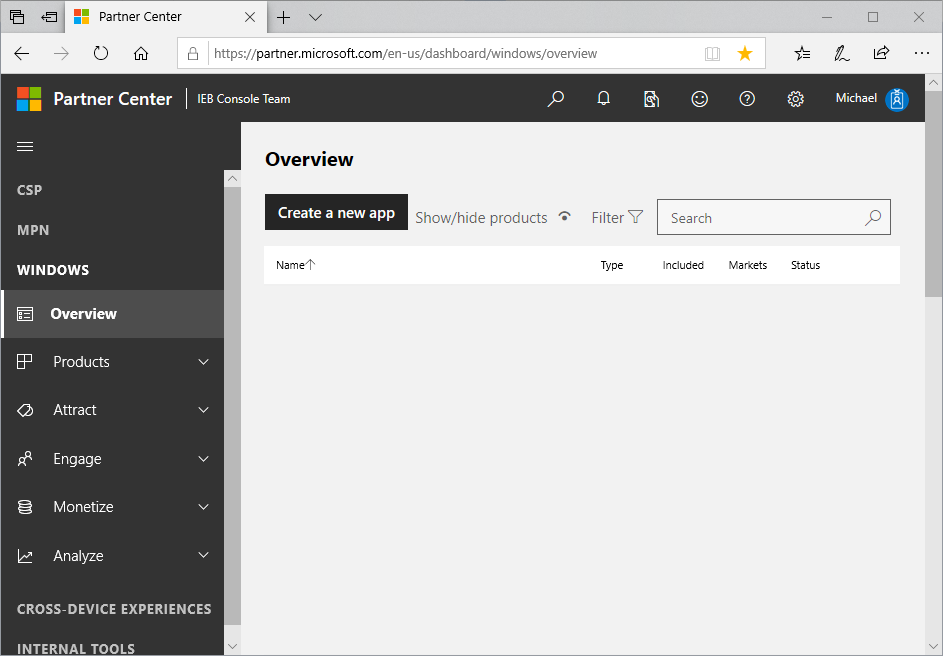
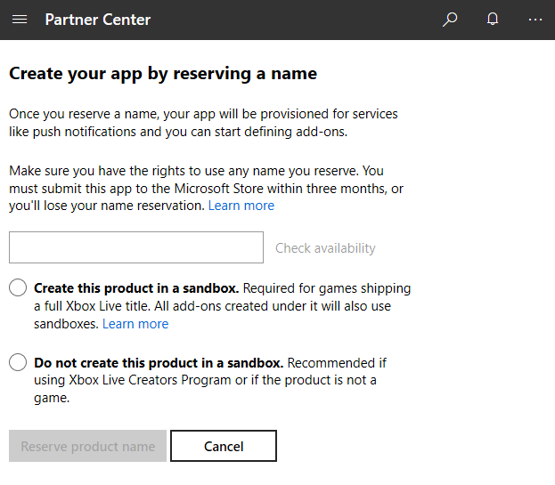
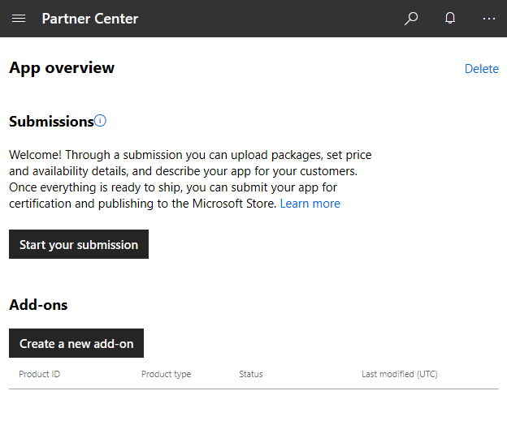
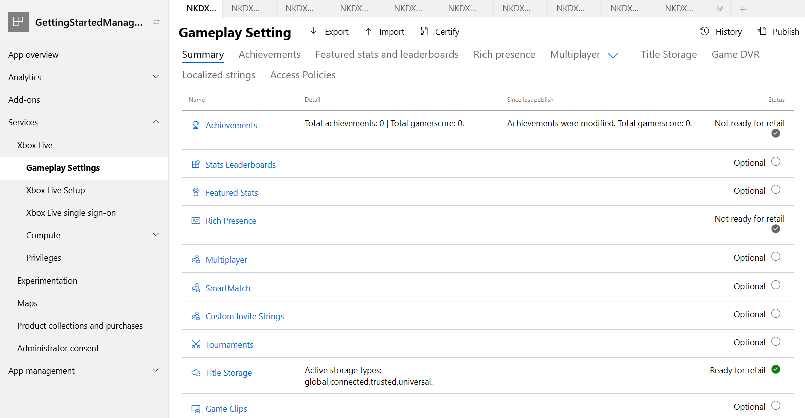
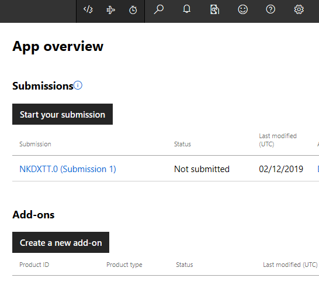
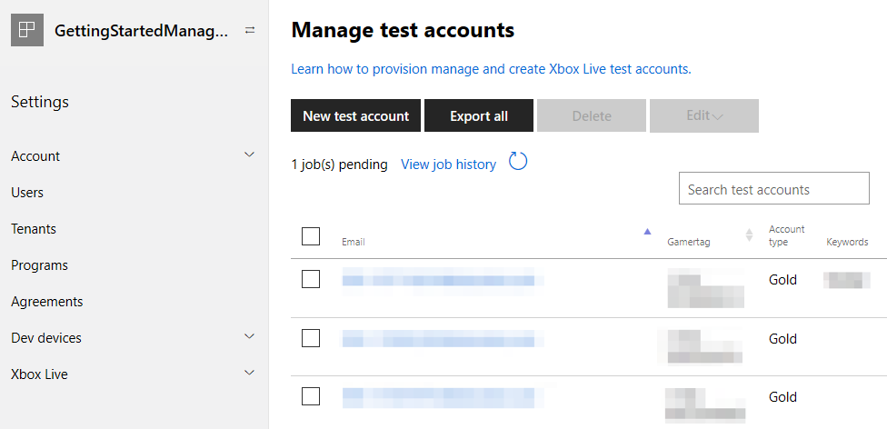

# Setting up a game at Partner Center, for ID\@Xbox Partners

<!--todo: open external links in new tab-->

To add Xbox Live functionality to your game, start by setting up an app in Partner Center, by following the steps below.

## Prerequisite: Become a Creator or an ID@Xbox partner

   > [!IMPORTANT]
   > Prerequisite steps for ID@Xbox partners:
   > 1. Prepare a prototype of your game, such as a demo and screen captures.
   >
   > 2. If you aren't already an ID@Xbox partner, apply to the ID@Xbox program.
   >
   > An ID@Xbox partner is a Managed Partner.
   > To apply to become an ID@Xbox partner, right-click the following link and then click **Open in new window**: [Welcome to ID@Xbox](https://www.xbox.com/developers/id).
   > Follow the instructions at that site, which will result in a Microsoft Partner Center account being generated for you.

<!--===========================================================-->
## 1. Create a new app

Next, at Partner Center, create a new app, as follows.

1. Right-click the following link and then click **Open in new window**: [Partner Center dashboard](https://partner.microsoft.com/dashboard/).

   The Partner Center dashboard appears, showing the "Overview" page, within the "WINDOWS" section.

   <!-- status: clear the items, keep table header -->
   

2. Click the **Create a new app** button.

   The page "Create your app by reserving a name" appears.

   <!-- status: ok -->
   

3. In the text box, enter the name of your product.
   You can change the name later.

4. Click the check box **Create this product in a sandbox**.

   > [!IMPORTANT]
   > For ID@Xbox partners, to enable Xbox Live functionality, you **MUST** select the option button **Create this product in a sandbox**, the first time through this process.
   > You won't be able to select this option button later.
   > (Do not select the check box "Do not create this product in a sandbox".)

   <!-- status: nuke "02mihof" -->
   

5. Click the **Reserve product name** button.

   The "App overview" page appears.

   <!-- status: ok -->
   

6. Click the **Start your submission** button.

   The "Start your submission" dialog box appears.

   <!-- status: ok -->
   

7. In the "Select the sandbox..." combo field, click the down-arrow on the right, then click a sandbox; for example, "NKDXTT.0 (shared)".

   Note which sandbox you selected, for later.

8. Click the **Create submission** button.

   After a delay, the submission page appears, showing the name of the sandbox and the submission number; for example, "NKDXTT.0 (Submission 1)".

   Your app has now been created at Partner Center and is awaiting being Xbox Live-enabled.

<!--===========================================================-->
## 2. Contact your Microsoft Representative to enable your game

1. In Partner Center, select your game.  

   The "App overview" page appears.

2. Click **App management**: **App identity**.

   The "Identity details" page appears.

   <!-- status: nuke "Greg02" (upper right), blur the CN string below that, PFN line: nuke or blur "Greg02_q", blur Package SID value, URL: blur the 9##### string; Store id: blur the value; Store Protocol link: blur the value starting with 9.  -->
   

3. Copy the **Store ID**.

4. Contact your Microsoft representative to ask them to add Xbox Live capability to your title.
   Include the store ID.
   For example:

   * **Subject**: Need to enable game for Xbox Live

   * **Body**: "Hi support, I would like to enable my Partner Center product.  The store ID is [your game's store ID]."

   Your Microsoft representative emails you; for example: "You can now enable your product in Partner Center."

<!--===========================================================-->
## 3. Enable Xbox Live for the game

<!-- todo: closing browser will cause to lose their place in this doc. tell how to return here. -->

When you receive the above email from your MS Representative, continue with the following steps.

   > [!IMPORTANT]
   > First, close the browser, including all of the browser's window instances, to clear the session cache.
   > Then open a new browser, and return to this section of this page.

1. Go to Partner Center.
   To do this, you can right-click the following link and then click **Open in new window**: [Partner Center dashboard](https://partner.microsoft.com/dashboard/).

2. Click **Products**, and then click your game.

   The "App overview" page appears.

   <!-- status: crop to elim the browser frame and url. keep black area.  delete "Greg02" from black area. delete the projects below that in black area. -->
   

3. Under **Services**, click **Xbox Live**.

   The "Enable Xbox Live" page appears, this first time only.

   <!-- status: ok -->
   

4. In the "Xbox Live app name" text box, enter the name of your game.
   You can use the same name as shown at the top of the page, but it doesn't need to be the same.

5. Click the **Enable** button.  

   Below the "Enable" button, a message temporarily appears:
   "Your product is being Xbox Live enabled.  This may take a few minutes."

   After some time, the Xbox Live "Gameplay Setting" page automatically appears.
   
   <!-- status: cropped, ok now? -->
   

You've now completed the initial setup of your game.
Your game cannot be tested yet; you need to publish the game first.
To do this, you take the identity information that was generated above, and push that information into the Xbox Live runtime system, as follows.

<!--===========================================================-->
## 4. Publish the game

In Partner Center, with your game selected as in the above procedures, do the following.

1. In the top right, click the **Publish** link.

   The "Publish gameplay settings" dialog box appears.

   <!-- status: ok -->
   

2. Click the **Confirm** button.

   At the bottom of the dialog box, the message appears: "Publishing configuration..." and then "Publishing configuration finished successfully."
   The game is actually published after a delay of possibly 20 minutes.  IMPORTANT: THOUGH THE UI SAYS THE JOB IS COMPLETE, THE XBOX LIVE SERVERS CAN TAKE AS LONG AS 30 MINUTES TO REPLICATE THE NEW INFO.

3. Click the **Close** button.

   The "Publish gameplay settings" dialog box closes, and the "Gameplay Setting" page remains displayed.

The SDK can now be used in an application to sign-in.

Next, find the ID of your game, as follows.

<!--===========================================================-->
## 5. Find your Xbox Live game information

In Partner Center, with your game selected as in the above procedures, do the following.

1. Click **Service**: **Xbox Live**: **Xbox Live Setup**.

   The "Xbox Live configuration" page appears.

   <!-- status: crop to exclude window frame and black left nav column. white-out "greg". blur the 3 numeric strings. -->
   

2. Copy and save the two Title ID values for later, for use by the SDK.

<!--===========================================================-->
## 6. Create Test Accounts

1. In Partner Center, click **Products* on the left: click the product you created.

   The "App overview" page appears.

   <!-- status: ok -->
   

2. Click the **Settings** gear in the upper right, then click **Developer settings**.

   The "Account settings" page appears.

   <!-- status: ok -->
   

3. In the **Settings** area in the middle, click **Xbox Live**: **Xbox test accounts**.

   <!-- status: ok -->
   

   The "Manage test accounts" page appears.

   <!-- status: white-out the existing entries, keep table header -->
   

4. Click the **New test account** button.

   The "New test accounts" page appears.

   <!-- status: white-out alternate email address v-mihof@ms... -->
   

5. In the **Number of accounts to create** text box, enter a number, such as 5.

6. Fill in the **First name** and **Last name** text boxes.
   You can keep the default values "Test" and "Account".

7. In the **Email template** combo box to the left of the hyphen, is shown the sandbox prefix.
   You can keep the value shown.

8. In the email text box to the right of the hyphen, enter the name of your game, without spaces.

9. In the **Password** text box, enter a password.

10. In the **Secret question** drop-down list, select a question.

11. In the **Secret answer** text box, enter an answer for the selected question.

12. In the **Alternate email address** text box, enter an alternate email address.

13. In the **Keywords** text box, you can put your name.

14. Under **These accounts can access:**, there is a check box for each sandbox.
    Select the sandbox which you selected during the **Submission** step above.

15. Click the **Save** button.

    The "Manage test accounts" page appears, showing your new test accounts.
    You can use these acccount email addresses later to sign in with an app, that can access the sandbox.

   <!-- status: white-out "hoffman", white-out "ignore" 2x, white-out rightmost 50% of digits on Gamertag (2x) -->
   

16. Under the **New test account** button, click the **View job history** link.  

    The "Job History" dialog box appears.  

    <!-- status: crop to only show the topmost 2 items -->
   

17. Click the page outside the dialog box.

    The dialog box closes; the "Manage test accounts" page remains displayed.

Your game is now set up at Partner Center.

<!--===========================================================-->
## Next step

After your game is set up at Partner Center, continue with step 2: set up an IDE with the Xbox Live SDK, for your target platforms.
See [Getting started](index.md).

<!--===========================================================-->
## See also

[Partner Center Xbox Live configuration Summary page](../configure-xbl/dev-center/summary.md)
