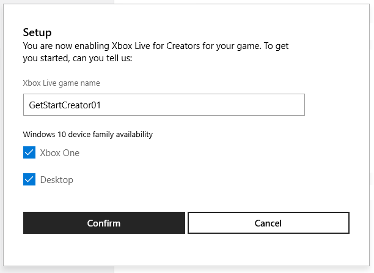

# Setting up a game at Partner Center, for Creators

To add Xbox Live functionality to your game, start by setting up an app in Partner Center, by following the steps below.

> [!IMPORTANT]
> Prerequisite for Creators:
> * Apply to the Creators Program; see the section [Creators Program](../../developer-program-overview.md#creators-program) in "Joining a developer program".

<!--===========================================================-->
## 1. Create a new app

At Partner Center, create a new app representing your game, as follows.

1. Go to <a href="https://partner.microsoft.com/dashboard/" target="_blank">Partner Center</a>.

   The Partner Center dashboard appears, showing the "Overview" page, within the "WINDOWS" section.

   

2. Click the **Create a new app** button.

   The page "Create your app by reserving a name" appears.

   

3. In the text box, enter the name of your product.
   You can change the name later.

4. If you see option buttons **Create this product in a sandbox** and **Do not create this product in a sandbox**, you must select the option button **Do not create this product in a sandbox**.

5. Click the **Reserve product name** button.

   The "App overview" page appears.

   

6. Click the **Start your submission** button.

   The "Submission #" page appears, showing the submission number; for example, "Submission 1".

   

   In the "Xbox Live Creators Program" section of the page, the message appears:
   "To enable Xbox Live Creators Program, the product's category (on the Properties page) must be Games."

   Your app has now been created at Partner Center and is awaiting being Xbox Live-enabled.

<!--===========================================================-->
## 2. Enable Xbox Live for the game

1. In the "Submission #" page, click the **Properties** section.

   The "Properties" page appears.

   

2. In the **Category and subcategory** section, in the **Pick a category** drop-down list, select the **Games** category.

   > [!IMPORTANT]
   > Do not select a category other than Games, or else the "Xbox Live" options won't be available.

   Because you selected Games, the "Genre(s) section appears.

   

3. In the **Genre(s)** section, select one or more check boxes.

   <!-- todo: confirm -->
   Skip the other fields for now.

4. Scroll down to the bottom of the page, and click the **Save** button.

   The "Submission #" page reappears, and the "Xbox Live Creators Program" section of the page is now available.

   

5. Click the **Xbox Live Creators Program** section in the page.

   The "Enable Xbox Live Creators Program" page appears, the first time through this process for a new game.

   

6. Click the **Enable** button.

   The "Setup" dialog box appears.

   

7. In the **Xbox Live game name** text box, enter the name of your game.
   This can be the same as the name of the app you specified at the beginning, but it doesn't need to be the same.

8. Select the platforms that you would like to enable the Xbox Live Services for.
   Both **Xbox One** and **Desktop** are selected by default.

8. Click the **Confirm** button.

   Below the Confirm button, the message temporarily appears:
   "Your product is being Xbox Live enabled. This may take a few minutes."

   Then the "Xbox Live Creators Program" page appears.

   

You've now completed the initial setup of your game.
Your game cannot be tested yet; you need to publish the game first.
To do this, you take the identity information that was generated above, and push that information into the Xbox Live runtime system, as follows.

<!--===========================================================-->
## 3. Authorize Xbox Live accounts to test the game

### Create an Xbox account for testing

1. If you don't have an Xbox account that you want to use for testing, create one.
   To create an Xbox account for testing, see <a href="https://www.xbox.com" target="_blank">Xbox.com</a>.

2. Click **Sign in**.

   The "Sign in" dialog box appears.

3. Click the **Create one!** link.

   Note the new email address and password.

### Go to the "Xbox Live Creators Program" page

In Partner Center, if you are not already at the "Xbox Live Creators Program" page for your game, go there as follows.

1. On the left, click **Products**, then under Products, click your game.

   The "App overview" page appears.

2. In the **Submissions** section of the page, click an item, such as **Submission 1**.

   The "Submission #" page appears. To the left, "Submissions: Submission #" is highlighted.

3. Click the **Xbox Live Creators Program** section.

   The "Xbox Live Creators Program" page appears.

   

### Authorize Xbox Live accounts for testing the game

1. In the "Xbox Live Creators Program" page, scroll down to the **Test** section.

   

2. Click the **Authorize Xbox Live accounts** link.

   The "Manage Accounts" page appears, in a new tab of the browser.

   

3. Click the **Add account** button.

   The "Please enter an Xbox Live email address" dialog box appears.

   

4. In the text box, enter your Xbox Live email address to use for testing.

5. Click the **Add** button.

   <!--todo: confirm & capture-->
   The "Manage Accounts" page reappears, now showing the added email address.

## 4. Publish the game using the Test button

1. Click the previous browser tab to see the "Xbox Live Creators Program" page: "Test" section.

   

2. Click the **Test** button.

   Below the Test button, the message "Publishing" appears, and then "Success" appears.

   > [!IMPORTANT]
   > Though the UI says "Success", the Xbox Live servers can take as long as 30 minutes to replicate the new info.

Your game is now set up at Partner Center.
The SDK can now be used in an application to sign-in.

<!--===========================================================-->
## Next step

After your game app is set up at Partner Center, set up your IDE to use the Xbox Live SDK; see [Getting Started](../index.md).
