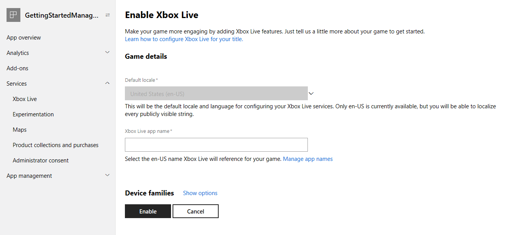
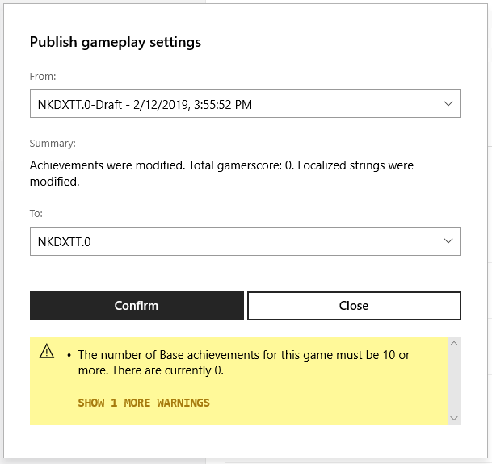
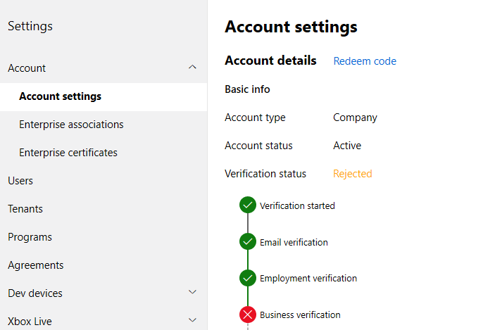
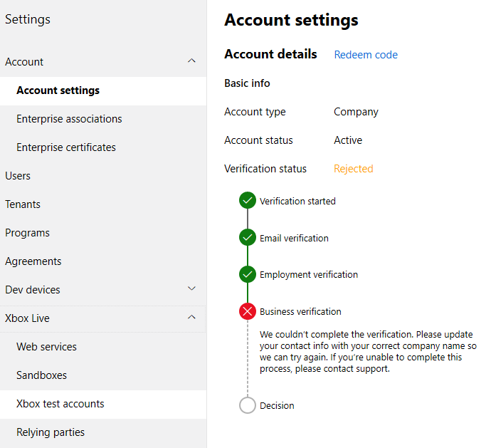
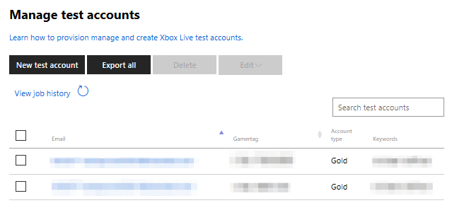

# Setting up a game at Partner Center, for Creators

<!--
todo:
Update the status for each image.
-->

To add Xbox Live functionality to your game, start by setting up an app in Partner Center, by following the steps below.

## Prerequisite: Become a Creator

   > [!IMPORTANT]
   > Prerequisite steps for Creators:
   > Create a Dev Account (also called a Partner Center account).
   > To create a Dev Account, see <a href="https://docs.microsoft.com/partner-center/mpn-create-a-partner-center-account" target="_blank">Create a Partner Center account</a> at the Partner Center documentation site.
   > Follow the instructions at that site.

   <!-- > To create a Dev Account, right-click the following link and then click **Open in new window**: [Create a Partner Center account](https://docs.microsoft.com/partner-center/mpn-create-a-partner-center-account). -->

<!--===========================================================-->
## 1. Create a new app

At Partner Center, create a new app representing your game, as follows.

1. Go to <a href="https://partner.microsoft.com/dashboard/" target="_blank">Partner Center</a>.

<!-- 1. Right-click the following link and then click **Open in new window**: [Partner Center dashboard](https://partner.microsoft.com/dashboard/). -->

   The Partner Center dashboard appears, showing the "Overview" page, within the "WINDOWS" section.

   <!-- status: ok -->
   

2. Click the **Create a new app** button.

   The page "Create your app by reserving a name" appears.

   <!-- status: ok -->
   

3. In the text box, enter the name of your product.
   You can change the name later.

4. If you see option buttons **Create this product in a sandbox** and **Do not create this product in a sandbox**, you must select the option button **Do not create this product in a sandbox**.

5. Click the **Reserve product name** button.

   The "App overview" page appears.

   <!-- status: ok -->
   

6. Click the **Start your submission** button.

   After a delay, the "Submission #" page appears, showing the submission number; for example, "Submission 1".

   <!-- todo: ok -->
   

   In the "Xbox Live Creators Program" section of the page, the message appears:
   "To enable Xbox Live Creators Program, the product's category (on the Properties page) must be Games."

   Your app has now been created at Partner Center and is awaiting being Xbox Live-enabled.

<!--===========================================================-->
## 2. Enable Xbox Live for the game

<!-- todo: closing browser will cause to lose their place in this doc. tell how to return here. -->

1. In the "Submission #" page, click the **Properties** section.

   The "Properties" page appears.

   <!-- todo: ok locally now -->
   

2. In the **Category and subcategory** section, in the **Pick a category** drop-down list, select the **Games** category.

   > [!IMPORTANT]
   > Do not select a category other than Games, or else the "Xbox Live" options won't be available.

   Because you selected Games, the "Genre(s) section appears.

   <!-- status: ok now? -->
   

3. In the **Genre(s)** section, select one or more check boxes.

   <!-- todo: update the below steps-->
   Skip the other fields for now.

4. Scroll down to the bottom of the page, and click the **Save** button.

   The "Submission #" page reappears, and the "Xbox Live Creators Program" section of the page is now available.

   <!-- status: ok -->
   

5. Click the **Xbox Live Creators Program** section in the page.

   The "Enable Xbox Live Creators Program" page appears, the first time through this process for a new game.

   <!-- status: ok -->
   

6. Click the **Enable** button.

  The "Setup" dialog box appears.

   <!-- status: ok -->
   

7. In the **Xbox Live game name** text box, enter the name of your game.
   This can be the same as the name of the app you specified at the beginning, but it doesn't need to be the same.

8. Select the platforms that you would like to enable the Xbox Live Services for.
   Both **Xbox One** and **Desktop** are selected by default.

8. Click the **Confirm** button.

   Below the Confirm button, the message temporarily appears:
   "Your product is being Xbox Live enabled. This may take a few minutes."

   Then the "Xbox Live Creators Program" page appears, with the message at the top "Please ensure to publish your changes to Xbox Live before you can upload files to global storage."

   <!-- status: todo: blur the Title ID value, the SCID value, the Sandbox ID value -->
   

<!-- 
todo: delete this comment (2 parts)

the above steps worked, including "Enable".  Below are steps we tried for Creators, to make Xbox Live appear under Services:

5. To the left of the "Submission #" page, click **Services** to expand it, and see whether **Xbox Live** appears within the **Services** options.

   

6. If **Xbox Live** doesn't appear yet, try the following:

7. Try reloading the page in the web browser.

8. Try: In the "Submission #" page, click the Properties section.
   The "Properties" page appears.
   In the "Support info" section, click the **No** option button, and then at the bottom of the page, click the **Save** button.

   Under "Services", "Xbox Live" now appears.

ID STEPS:

9. Under **Services**, click **Xbox Live**.

   The "Enable Xbox Live" page appears, this first time only.

   

2. In the "Xbox Live app name" text box, enter the name of your game.
   You can use the same name as shown at the top of the page, but it doesn't need to be the same.

5. Click the **Enable** button.  

   Below the "Enable" button, a message temporarily appears:
   "Your product is being Xbox Live enabled.  This may take a few minutes."

   After some time, the Xbox Live "Gameplay Setting" page automatically appears.

    -->

You've now completed the initial setup of your game.
Your game cannot be tested yet; you need to publish the game first.
To do this, you take the identity information that was generated above, and push that information into the Xbox Live runtime system, as follows.

<!--===========================================================-->
## 3. Publish the game

### Go to the "Xbox Live Creators Program" page

If you are not already at the "Xbox Live Creators Program" page for your game, go there as follows.

1. On the left, click **Products**, then under Products, click your game.

   The "App overview" page appears.

2. In the **Submissions** section of the page, click an item, such as **Submission 1**.

   The "Submission #" page appears. To the left, "Submissions: Submission #" is highlighted.

3. Click the **Xbox Live Creators Program** section.

   The "Xbox Live Creators Program" page appears.

   <!-- status: todo: blur the Title ID value, the SCID value, the Sandbox ID value (per above for this image file) -->
   

### Publish using the Test button

1. In the "Xbox Live Creators Program" page, scroll down to the **Test** section.

2. Click the **Authorize Xbox Live accounts** (to use your test environment).

   The "Manage Accounts" page appears.

<!-- 
todo:
"Xbox Live" appears in left-nav at this point.
   

Where to place this img if needed?
-->

   <!-- status: ok -->
   

3. Click the **Add account** button.

   The "Please enter an Xbox Live email address" dialog box appears.

   <!-- status: ok -->
   

4. In the text box, enter your Xbox Live email address to use for testing, such as: DEV-123456789A@xboxtest.com <!--todo, gives message in red: "Sorry, there was an issue adding your email address." -->

5. Click the **Add** button.

   The "Manage Accounts" page reappears, now showing the added email address.  <!--todo: confirm-->

   <!-- todo: cleanup transition -->
   ... 

<!--
what to click to get back to the  "Xbox Live Creators Program" page: Test section: Test button? 
-->

7. Click the **Test** button.

   <!-- status: todo: cleanup sandbox name -->
   

   Below the Test button, the message "Publishing..." appears, and then "Success" appears.
   
<!-- ID:
1. In the top right, click the **Publish** link.

   The "Publish gameplay settings" dialog box appears.

   

2. Click the **Confirm** button.

   At the bottom of the dialog box, the message appears: "Publishing configuration..." and then "Publishing configuration finished successfully." -->

   <!-- true for Creators? -->

   > [!IMPORTANT]
   > Though the UI says "Success", the Xbox Live servers can take as long as 30 minutes to replicate the new info.

<!-- ID:
 3. Click the **Close** button.

   The "Publish gameplay settings" dialog box closes, and the "Gameplay Setting" page remains displayed.
-->

The SDK can now be used in an application to sign-in.

Next, find the ID of your game, as follows.

<!--===========================================================-->
## 4. Find your Xbox Live game information

<!-- todo: eliminate/move this section to later article? these steps aren't needed until after Getting Started -->

In Partner Center, with your game selected as in the above procedures, do the following.

1. Click **Service**: **Xbox Live**: **Xbox Live Setup**.

   <!-- todo: left-nav says "Services", not "Service", and doesn't list "Xbox Live" -->

   The "Xbox Live configuration" page appears.

   <!-- status: todo: this is ID version, create Creators version of capture - if these steps are needed -->
   

2. Copy and save the two Title ID values for later, for use by the SDK.

<!--===========================================================-->
## 5. Create a Test Account

<!-- todo: move up to top of Publish section? -->

1. In Partner Center, click **Products** on the left, and then click the product you created.

   The "App overview" page appears.

   <!-- status: ok -->
   

2. Click the **Settings** gear in the upper right, then click **Developer settings**.

   The "Account settings" page appears.

   <!-- status: ok -->
   

3. In the **Settings** area in the middle, click **Xbox Live**: **Xbox test accounts**.

   <!-- status: ok -->
   

   The "Manage test accounts" page appears.

   <!-- status: white-out the existing entries, keep table header -->
   

4. Click the **New test account** button.

   The "New test accounts" page appears.

   <!-- status: white-out alternate email address v-mihof@ms... -->
   

5. In the **Number of accounts to create** text box, enter a number, such as 5.

6. Fill in the **First name** and **Last name** text boxes.
   You can keep the default values "Test" and "Account".

7. In the **Email template** combo box to the left of the hyphen, is shown the sandbox prefix.
   You can keep the value shown.

8. In the email text box to the right of the hyphen, enter the name of your game, without spaces.

9. In the **Password** text box, enter a password.

10. In the **Secret question** drop-down list, select a question.

11. In the **Secret answer** text box, enter an answer for the selected question.

12. In the **Alternate email address** text box, enter an alternate email address.

13. In the **Keywords** text box, you can put your name.

14. Under **These accounts can access:**, there is a check box for each sandbox.
    Select the sandbox which you selected during the **Submission** step above.

15. Click the **Save** button.

    The "Manage test accounts" page appears, showing your new test accounts.
    You can use these acccount email addresses later to sign in with an app, that can access the sandbox.

   <!-- status: white-out "hoffman", white-out "ignore" 2x, white-out rightmost 50% of digits on Gamertag (2x) -->
   

16. Under the **New test account** button, click the **View job history** link.  

    The "Job History" dialog box appears.  

    <!-- status: ok locally -->
   

17. Click the page outside the dialog box.

    The dialog box closes; the "Manage test accounts" page remains displayed.

Your game is now set up at Partner Center.

<!--===========================================================-->
## Next step

After your game is set up at Partner Center, continue with step 2: set up an IDE with the Xbox Live SDK, for your target platforms.
See [Getting started](index.md).

<!--===========================================================-->
## See also

[Partner Center Xbox Live configuration Summary page](../../configure-xbl/dev-center/summary.md)
