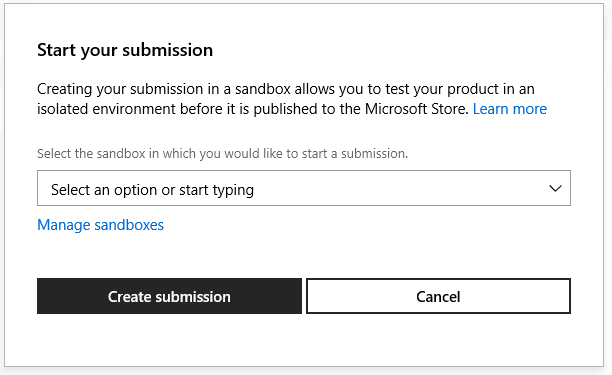

# Setting up a game at Partner Center, for ID\@Xbox Partners

To add Xbox Live functionality to your game, start by setting up a game in Partner Center, by following the steps below.

## Prerequisites

* Have a prototype of your game, such as a demo and screen captures.

* [Joining the ID@Xbox Program](../join-dev-program/join-mp-program.md).

<!--===========================================================-->
## 1. Create a new game

Next, at Partner Center, create a new game, as follows.

1. Go to <a href="https://partner.microsoft.com/dashboard/" target="_blank">Partner Center</a>.

   The Partner Center dashboard appears, showing the "Overview" page, within the "WINDOWS" section.

   

2. Click the **Create a new...** button.

   The page "Create your app by reserving a name" appears.

   

3. In the text box, enter the name of your product.
   You can change the name later.

4. Click the check box **Create this product in a sandbox**.

   > [!IMPORTANT]
   > To enable Xbox Live functionality, you **MUST** select the option button **Create this product in a sandbox**, the first time through this process.
   > You won't be able to select this option button later.
   > (Do not select the check box "Do not create this product in a sandbox".)

   

5. Click the **Reserve product name** button.

   The "App overview" page appears.

   

6. Click the **Start your submission** button.

   The "Start your submission" dialog box appears.

   

7. In the "Select the sandbox..." combo field, click the down-arrow on the right, then click a sandbox; for example, "NKDXTT.0 (shared)".

   Note which sandbox you selected, for later.

8. Click the **Create submission** button.

   After a delay, the submission page appears, showing the name of the sandbox and the submission number; for example, "NKDXTT.0 (Submission 1)".

   Your app has now been created at Partner Center and is awaiting being Xbox Live-enabled.

<!--===========================================================-->
## 2. Contact your Microsoft Representative to enable your game

1. In Partner Center, select your game.  

   The "App overview" page appears.

2. Click **App management**: **App identity**.

   The "Identity details" page appears.

   

3. Copy the **Store ID**.

4. Contact your Microsoft representative to ask them to add Xbox Live capability to your title.
   Include the store ID.
   For example:

   * **Subject**: Need to enable game for Xbox Live

   * **Body**: "Hi support, I would like to enable my Partner Center product.  The store ID is [your game's store ID]."

   Your Microsoft representative emails you; for example: "You can now enable your product in Partner Center."

<!--===========================================================-->
## 3. Enable Xbox Live for the game

When you receive the above email from your MS Representative, continue with the following steps.

   > [!IMPORTANT]
   > 1. Save the URL for this page; for example, add this page to Favorites in the browser.
   > 2. Close the browser, including all of the browser's window instances, to clear the session cache.
   > 3. Open a new browser, and return to this section of this page.

1. Go to <a href="https://partner.microsoft.com/dashboard/" target="_blank">Partner Center</a>.

   The "Overview" page appears.

   

2. Click **Products**, and then click your game.

   The "App overview" page appears.

   

3. Under **Services**, click **Xbox Live**.

   The "Enable Xbox Live" page appears, this first time only.

   

4. In the "Xbox Live app name" text box, enter the name of your game.
   You can use the same name as shown at the top of the page, but it doesn't need to be the same.

5. Click the **Enable** button.  

   Below the "Enable" button, a message temporarily appears:
   "Your product is being Xbox Live enabled.  This may take a few minutes."

   After some time, the Xbox Live "Gameplay Setting" page automatically appears.

   

You've now completed the initial setup of your game.
Your game cannot be tested yet; you need to publish the game first.
To do this, you take the identity information that was generated above, and push that information into the Xbox Live runtime system, as follows.

<!--===========================================================-->
## 4. Publish the game

In Partner Center, with your game selected as in the above procedures, do the following.

1. In the top right, click the **Publish** link.

   The "Publish gameplay settings" dialog box appears.

   

2. Click the **Confirm** button.

   At the bottom of the dialog box, the message appears: "Publishing configuration..." and then "Publishing configuration finished successfully."

   > [!IMPORTANT]
   > Though the UI says "finished successfully", the Xbox Live servers can take as long as 30 minutes to replicate the new info.

3. Click the **Close** button.

   The "Publish gameplay settings" dialog box closes, and the "Gameplay Setting" page remains displayed.

The SDK can now be used in an application to sign-in.

<!--===========================================================-->
## 5. Create Test Accounts

1. In Partner Center, click **Products** on the left, and then click the product you created.

   The "App overview" page appears.

   

1. Click the **Settings** gear in the upper right, then click **Developer settings**.

   The "Account settings" page appears.

   

1. In the **Settings** area in the middle, click **Xbox Live**: **Xbox test accounts**.

   

   The "Manage test accounts" page appears.

   

1. Click the **New test account** button.

   The "New test accounts" page appears.

   

1. In the **Number of accounts to create** text box, enter a number, such as 5.

1. Fill in the **First name** and **Last name** text boxes.
   You can keep the default values "Test" and "Account".

1. In the **Email template** combo box to the left of the hyphen, is shown the sandbox prefix.
   You can keep the value shown.

1. In the email text box to the right of the hyphen, enter the name of your game, without spaces.

1. In the **Password** text box, enter a password.

1. In the **Secret question** drop-down list, select a question.

1. In the **Secret answer** text box, enter an answer for the selected question.

1. In the **Alternate email address** text box, enter an alternate email address.

1. In the **Keywords** text box, you can put your name.

1. Under **These accounts can access:**, there is a check box for each sandbox.
    Select the sandbox which you selected during the **Submission** step above.

1. Click the **Save** button.

    The "Manage test accounts" page appears, showing your new test accounts.
    You can use these acccount email addresses later to sign in with an app, that can access the sandbox.

   

1. Under the **New test account** button, click the **View job history** link.  

    The "Job History" dialog box appears.  

   

1. Click the page outside the dialog box.

    The dialog box closes; the "Manage test accounts" page remains displayed.

Your game is now set up at Partner Center.

<!--===========================================================-->
## 6. Find the game's IDs at Partner Center

At Partner Center, find the Title ID, SCID, Sandbox ID, and Client ID of your game, as follows.
When you add basic sign-in code to your game, you will insert these IDs.

1. Go to <a href="https://partner.microsoft.com/en-us/dashboard/" target="_blank">Partner Center</a>.

2. On the left, click **Products**, then click your game app.

   The "App overview" page appears.

3. In the **Submissions** section of the page, click **&lt;sandbox&gt; (Submission <#>)**.

   The "&lt;sandbox&gt; Submission <#>" page appears.

4. Copy and save the sandbox name for the sandbox which you want to use, such as "ABCDEF.1".

5. Click the **Xbox Live Config** section of the page.

   The "Gameplay Setting" page appears.

6. In the middle navigation column, click **Services**, and then click **Xbox Live Setup**.

   The "Xbox Live configuration" page appears.

7. In the **Xbox Live product identities** section of the page, copy and save the **Title ID (decimal)**, **MsaAppId** (this is the Client ID),  and **SCID**.

The app's MSA App ID is known as the _Client ID_, inside XAL.

## Update Microsoft Account (MSA) configuration for your mobile game

> [!IMPORTANT]
> The following steps are only needed if your game targets mobile platforms (that is, Android or iOS).

1. Log into your app's registration page via <a href="https://apps.dev.microsoft.com" target="_blank">MSA's app portal &#11008;</a>.

2. Identify your app's MSA App ID (known as the Client ID, within XAL), and then click the app name.

   The **App Details** page appears.

3. Under **Platforms**, if there isn't a **Native Application** section, click the **Add Platforms** button, and then click **Native Applications**.

4. In the "Native Application" section, add a Custom Redirect URI, as follows:

   `ms-xal-`&lt;_MSA App ID as lowercase_&gt;`://auth`

   For example:

   `ms-xal-00000000abcdef12://auth`

5. Save your app's configuration.

<!--===========================================================-->
## Next step

[Setting up an IDE, for ID@Xbox Partners](../setup-ide/managed-partners/index.md)

## See also

[Getting Started](../index.md)
