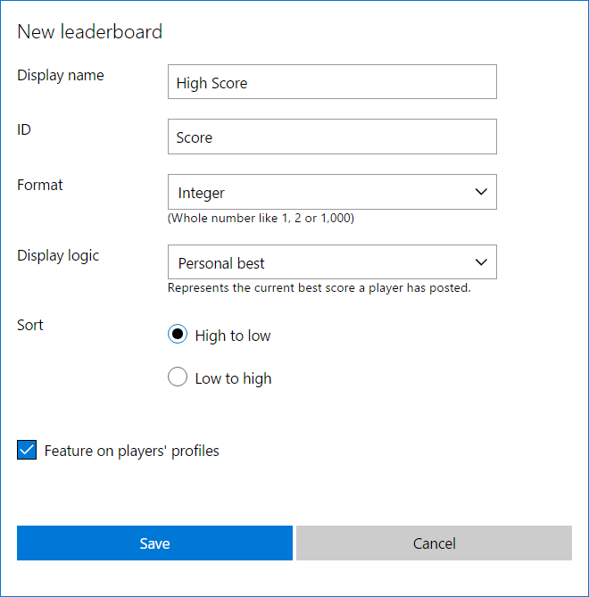

# Configuring Featured Stats or Leaderboards in Partner Center with Player Data 2017

With Player Data 2017, you only need to configure a stat in two cases:
* The stat is used as a basis for a global leaderboard, or
* The stat is a featured player stat that will be displayed on the game hub page.

In either case, you must configure Stats and leaderboards together.
Every leaderboard is based on a stat, and you cannot configure a stat without also configuring an associated global leaderboard, even if you do not plan to use a leaderboard for a featured player stat.

You do not need to configure Stats that are not featured player Stats, and are not used by a global leaderboard.

## Configure a global leaderboard and an associated player stat

First, go to the Player Stats section for your title as shown below.

Then click the `Create your first featured stat/leaderboard` button, and then fill out this dialog and click Save.

The `Display name` field is what users will see in the GameHub.

This string can be localized in the `Localize strings` section.
To see details on how to localize these strings, in the `Localize strings` section, click `Show Options`.

The `ID` field is the stat name and will be how you will refer to your stat when updating it from your title code.
For more detail, see the [Updating Stats](player-stats-updating.md) section below.

The `Format` is the data format of the stat.

The `Display Logic` offers the choice between `Player progression`, `Personal best`, and `Counter`:
- Player progression: Represents an individual player level or progression in the game.  The last value set is what users will see.  For example, position in current round.
- Personal Best: Represents the current best score a player has posted. The max or min value set depending on sort order is what users will see.  For example, fastest lap.
- Counter: Can be added to other player's to calculate a cumulative number.  

The `Sort` field lets you change the sort order of the leaderboard.

You can also choose to make this stat a `Featured Stat`, but clicking on `Feature on players' profiles`.

## Configure Featured Stats

When you define a player stat, you have the option of checking `Featured Stat`.
Note the following requirements:

| Developer Type | Requirement |
|----------------|-------------|
| Xbox Live Creators Program | There is no requirement to designate any Stats as Featured Stats. You are limited to a maximum of 10 Featured Stats.|
| ID@Xbox and Microsoft Partners | You must designate between 3 and 10 Featured Stats |

## Next Steps

Next, update the stat from title code; see [Updating Stats](player-stats-updating.md).
