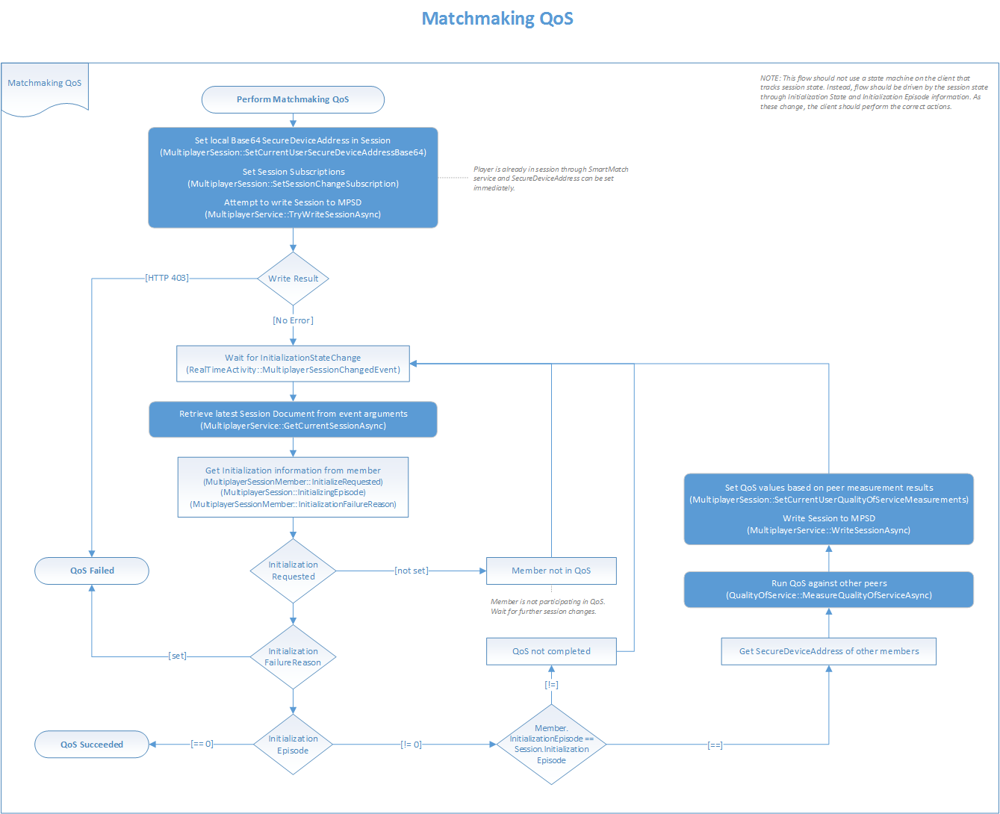

## Target Session Initialization and QoS

A group of players is matched into a target session by SmartMatch matchmaking. The title must take steps to confirm that enough players have joined that they can successfully connect to one another if they need to. This process is known as target session initialization.

For games using peer-to-peer network topologies, an important aspect of target session initialization is QoS measurement and evaluation.
Associated operations are the measurement of latency and bandwidth between Xbox One consoles (or between consoles and servers), and the evaluation of the resulting measurements to determine whether the network connection between nodes is good.

The following flow chart illustrates how to implement the initialization of the target session and QoS operations.

### Managed Initialization

MPSD supports a feature called "managed initialization" through which it coordinates the target session initialization process across the clients involved in a session.
MPSD automatically tracks the initialization stages and the associated timeouts for the session, and evaluates the connectivity among clients if needed.
Managed initialization is represented by the **MultiplayerManagedInitialization Class**.

| Note                                                                                                                  |
|------------------------------------------------------------------------------------------------------------------------------------|
| It is highly recommended for your title using SmartMatch matchmaking to take advantage of the MPSD managed initialization feature. |

#### Managed Initialization Episodes and Stages

A target session undergoes managed initialization any time matchmaking adds new players to the session.
SmartMatch adds session members as user state Reserved, meaning that each member takes up a slot but has not yet joined the session.
Each group of new players triggers a new initialization episode.

Upon completion of initialization, each player either succeeds or fails the process.
A player who succeeds in initializing can play using the target session.
A player who fails must be resubmitted to matchmaking to be matched into another session.

For cases where a session is submitted to matchmaking with the *preserveSession* parameter set to Always, the pre-existing members of the session do not undergo initialization, as MPSD assumes them to be properly set up.

Each managed initialization episode consists of these stages:
-   Joining -- session members write themselves to the session to move their user state from Reserved to Active, and upload basic data, such as secure device address.
-   Measurement -- for peer-based topologies, session members measure QoS to one another, and upload the results to the session.
-   Evaluation -- MPSD evaluates the results of the last two stages, and determines whether the session and/or members have successfully initialized.

The title code operates on the session to advance each user (and therefore the session) through the joining and measurement phases.
The title then can either start play or go back to matchmaking after the evaluation stage has succeeded or failed.

### Configuring the Target Session for Initialization

The title can configure the managed initialization process using constants in the target session being initialized.
These constants are set under /constants/system in the session template with version 107, the recommended template version.

Two types of configuration settings can be made:
- Settings that configure the managed initialization process as a whole.
- Settings that configure QoS requirements.

See [MPSD Session Templates](../multiplayer-session/mpsd-overview.md) for examples of session templates for common title scenarios.

| Note                                                                                                                              |
|------------------------------------------------------------------------------------------------------------------------------------------------|
| If QoS requirements are not defined in the target session initialization configuration the measurement stage during initialization is skipped. |

#### Configuring Managed Initialization as a Whole

Below are the fields to set to control managed initialization overall.

The fields to set to control managed initialization are part of the `/constants/system/memberInitialization` object:
- joinTimeout - Specifies how long MPSD waits for each member to join, after the initialization episode has begun. Default is 10 seconds.
- measurementTimeout - Specifies how long MPSD waits for each member to upload QoS measurement results, after the measurement stage has begun. Default is 30000 seconds.
- membersNeededToStart - Specifies the number of members who must succeed at initialization for the first initialization episode to succeed. Default is 1.

| Note                                              |
|----------------------------------------------------------------|
| If this threshold is not met, all members fail initialization. |

#### Configuring QoS Requirements

QoS is only needed during initialization if the title uses a peer-to-peer or peer-to-host topology.
Each topology maps to a topology-specific constant under /constants/system/.

###### Configuring QoS Requirements for Peer-to-peer Topology

| Note                                                                                                                                                                                         |
|-----------------------------------------------------------------------------------------------------------------------------------------------------------------------------------------------------------|
| It is rare for titles to make QoS requirement settings for the peer-to-peer topology. These settings are very restrictive and cause problems for players with strict network address translations (NATs). |

Peer-to-peer topology QOS requirements are set in the peerToPeerRequirements object.
Every client must be able to connect to every other client.

The object has the following pertinent fields:
-   latencyMaximum. Specifies the maximum latency between any two clients.
-   bandwidthMinimum. Specifies the minimum bandwidth between any two clients.

###### Configuring QoS Requirements for Peer-to-host Topology

Peer-to-host topology QOS requirements are set in the peerToHostRequirements object.
Every client must be able to connect to a single common host.
If this object is configured and initialization succeeds, MPSD will create an initial list of clients that are potential hosts, known as the "host candidates."

Here are the fields to set:
-   latencyMaximum - Specifies the maximum latency between each peer and the host.
-   bandwidthDownMinimum - Specifies the minimum downstream bandwidth between each peer and the host.
-   bandwidthUpMinimum - Specifies the minimum upstream bandwidth between each peer and the host.
-   hostSelectionMetric - Specifies the metric used to select the host.

## See also

[MPSD Session Templates](../multiplayer-session/mpsd-overview.md)
