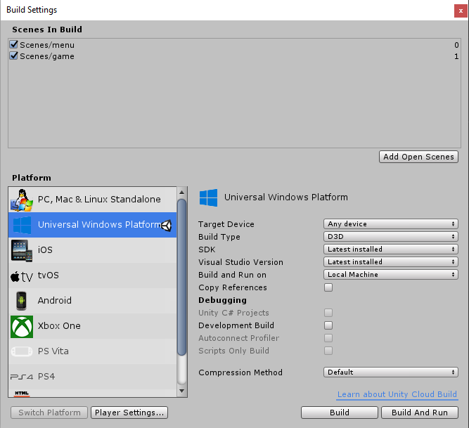
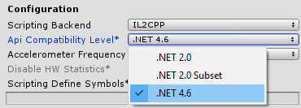
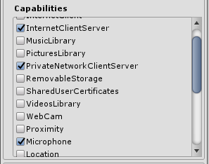
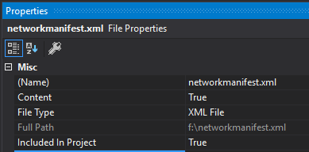

# Using XIM via Unity with IL2CPP

Windows Runtime Support for IL2CPP (Intermediate Language to C++) is available in Unity.

With the release of Unity 5.6f3, the engine has included a new feature that enables developers to use Windows Runtime (WinRT) components directly in script by including them in the game project directly.
Until version 5.6, developers have needed a plugin, or dll to support any platform feature (including Xbox Integrated Multiplayer) from game script in UWP.
This new projection layer removes the plugin requirement, and introduces a new and simplified workflow supported only with games that choose the IL2CPP scripting backend.

- For more information on how to get started with using WinRT and Unity, see the [Unity documentation](https://docs.unity3d.com/Manual/IL2CPP-WindowsRuntimeSupport.html).
- For more information on how to add Xbox Live support to Unity using IL2CPP, see the [Xbox Live documentation](https://docs.microsoft.com/windows/uwp/xbox-live/get-started-with-partner/partner-add-xbox-live-to-unity-uwp) on the subject.


## Using the XIM Unity asset package


### 1. Install Unity

Install Unity 5.6 or higher, and ensure you have the **Windows Store Il2CPP scripting backend** selected during installation


### 2. Install Visual Studio Tools for Unity version 3.1 and above for IntelliSense support when using WinMDs

For Visual Studio 2015, this can be found [in the Visual Studio Marketplace](https://marketplace.visualstudio.com/items?itemName=SebastienLebreton.VisualStudio2015ToolsforUnity).
For Visual Studio 2017, the component can be added inside the Visual Studio 2017 installer.


### 3. Open a new or existing Unity project


### 4. Switch the platform to Universal Windows Platform in the Unity Build Settings menu




### 5. Enable IL2CPP scripting backend in the Unity player settings, and set API compatibility to .NET 4.6




### 6. Import the latest version of the Xbox Integrated Multiplayer WinRT Unity asset package

This can be found at https://github.com/Microsoft/xbox-integrated-multiplayer-unity-plugin/releases


### 7. You can now use XIM in your scripts

For more guidance on how to use XIM with C#, see [Use XIM (C#)](using-xim-cs.md).

The following snippet shows how XIM might be integrated with your code:

```cs
using System;
using System.Collections;
using System.Collections.Generic;
using UnityEngine;

#if ENABLE_WINMD_SUPPORT
using Microsoft.Xbox.Services.XboxIntegratedMultiplayer;
#endif

public class XimScript
{
    public void Start()
    {
#if ENABLE_WINMD_SUPPORT
        XboxIntegratedMultiplayer.TitleId = XboxLiveAppConfiguration.SingletonInstance.TitleId;
        XboxIntegratedMultiplayer.ServiceConfigurationId = XboxLiveAppConfiguration.SingletonInstance.ServiceConfigurationId;
#endif
    }

    public void Update()
    {
#if ENABLE_WINMD_SUPPORT
        using (var stateChanges = XboxIntegratedMultiplayer.GetStateChanges())
        {
            foreach (var stateChange in stateChanges)
            {
                switch (stateChange.Type)
                {
                    case XimStateChangeType.PlayerJoined:
                        HandlePlayerJoined((XimPlayerJoinedStateChange)stateChange);
                        break;

                    case XimStateChangeType.PlayerLeft:
                        HandlePlayerLeft((XimPlayerLeftStateChange)stateChange);
                        break;
                    [...]
                }
            }
        }
#endif
    }
}
```

For more information on the `ENABLE_WINMD_SUPPORT` #define directive, see the Unity documentation on [Windows Runtime Support](https://docs.unity3d.com/Manual/IL2CPP-WindowsRuntimeSupport.html)


### 8. Required capability content

An application using XIM inherently requires connecting to and accepting connections from network resources both over the Internet and the local network.
It also requires access to microphone devices to support voice chat.
As a result, the app should declare the "InternetClientServer" and "PrivateNetworkClientServer" capabilities, and the "Microphone" device capability in the publishing settings found in player settings.




### 9. Build the project in Unity.

1. Go to File \| Build Settings, click **Universal Windows Platform** and make sure you click **Switch Platform**.

2. Click "Add Open Scenes" to add the current scene to the build.

3. In the SDK combo box, choose "Universal 10".

4. In the UWP build type combo box, choose "D3D", but "XAML" will also work if you prefer.

5. Click "Build" for Unity to generate the UWP Visual Studio project that wraps your Unity game in a UWP application.

    When you get prompted for a location, create a new folder to avoid confusion since a lot of new files will be created. It’s recommended you call the folder "Build", and then select that folder.

6. Add XIM's network manifest to your project.

    Add the networkmanifest.xml file:

    

    See [XIM Project Configuration](xim-manifest.md) for more information on the network manifest and its content.

7. Compile and run the UWP app from Visual Studio.

This will launch the app like a normal UWP app and allow Xbox Live calls to operate as they require a UWP app container to function.


### 10. Rebuild if you make changes to anything in Unity

If you change anything in Unity, then you must rebuild the UWP project.
