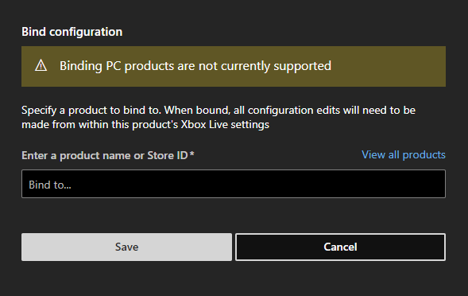

# Overview

This article walks through how-to setup two console products to share XBL Config. If you are interested in using the feature, please reach out to your Microsoft representative. 

## What is it?

This guide will touch on how to configure two titles to share the same XBL configuration. We be using the following terms to define both products:

-	**Primary Product** – The XBL enabled Partner Center game. All changes and publishes to XBL will happen in this product. All XBL config changes will impact in both products.
-	**Secondary Product** – This product is initially enabled, and content approved by Microsoft. It will share XBL configuration with the primary product. 

At the core of this feature is a partner center config change that will allow two or more products, to share the same XBL configuration. There is also a change to package metadata of the secondary product. Throughout the setup process, there are no required changes to the primary product.

### Benefits

One key reason for creating two separate products may be because the studio has put more resources into creating the Scarlett version of their title and thus want to sell it separately. 
Choosing this method might be ideal for developers that want to keep their player base intact despite having games that spans multiple generations. 
It also does not require any changes to the primary title which gives your studio additional flexibility to add a secondary version later.

##Policy and Use of XBL Game Binding

-	Title is only binding Console products together (i.e. gen 8 to gen 9 or gen 8 to gen 8)
-	The title only selects the platforms they are using for the game binding feature in Partner Center. There is special work that needs to be done to support cross-play across gen 8 and gen 9 games. If the title is only supporting gen 8 for the binding, it is advised that they do not also select Scarlett as a supported platform. As a workaround you can add the cross play capability to your multiplayer configuration.
-	All titles sharing the primary title config are close to carbon copies of the original or are the same title with a stripped-down experience. The developer needs to ensure there is a clear distinction to its product offerings from the store to set the right expectation with users. 
-	Once secondary product has gone GA, it should not be unbound. Binding and unbinding titles can only be supported while the secondary product is in production and not released to end-users. 
-	Titles Are comfortable with XBL changes being made to bound products
-	No versions are currently running on PC

There are plans to expand the scope and offerings of this feature. 

## What If You Want to Use XBL Game Binding With PC?

If you would like to use XBL for your title, the only avenue available is to ingest the PC package to your existing game and expand to include PC as a supported platform. 
As of right now, we do not have the support for a PC title to share configuration using the XBL Game Binding feature. 
If a title has a PC version, it is best for them to stick to sharing all packages within a single product. 

## What Has Been Tested by The Feature Team

 To ensure we had absolute confidence in the feature, the feature crew has tested XBL at all stages of using the feature (e.g. Pre, Bounded, Post Bound). 
 This test was accomplished using the following parameters:

**Test Products**

The below table represents the test products that were created to run the feature through its paces. These were designed to maximize the surface area of how XBL is being used by developers today. 
-	Primary Game Gen 8 ERA using Stats/Achievements 2013 and latest XDK
-	Primary Game Gen 8 ERA using Stats/Achievements 2017 and latest XDK
-	Secondary Game Gen 8 ERA using Stats/Achievements 2013 latest XDK
-	Secondary Game Gen 8 ERA using Stats/Achievements 2017 latest XDK

**XBL Features Tested**

To ensure there is transparency for testing this feature, we ran through all known XBL features.
The tests performed used the samples ATG provides to XBL developers and calls the same APIs our customers do to access various XBL features. 
Tt was essential that all products were in a working state throughout the binding process. 
This provides the greatest flexibility to our developers who will likely want to test this feature while actively in development of their title. 

## How To Configure Game Binding

The Below steps highlight the process you will go through to get both titles setup and properly configured. 
This process will require work on just the secondary product and not the primary product. 
This should only be attempted after the feature team has onboarded customers to use the feature.

**Entering the Flight**
 
If you are interested in using the feature, please reach out to your Microsoft representative first. 
They will be able to turn on the XBL Game Binding feature on your behalf. Once your studio is apart of the flight, you will have access to the feature for all future products. 

**Primary Product Setup In Partner Center**
  
You may be starting fresh with neither product created in Partner Center. The first part of the guide will walk you through how to setup your primary, XBL enabled product. 
1.	If you are starting fresh with no products setup, in Partner Center first create the title you wish to contain the XBL Configuration.
2.	Reach out to your Microsoft contact and get your primary title content approved and XBL Enabled. 
3.	Configure XBL config as you do normally and publish the content you wish to test in your desired sandbox. With the primary product XBL enabled, you will be able to access all the relevant XBL identifiers needed for your secondary product.

**Secondary Product Setup In Partner Center**
 
Now it is time to setup your secondary product with access to the XBL config in the primary product. 

1. Create the secondary product in Partner Center as a Game. 
> 
2.	Reach out to your Microsoft representative and get explain the purpose that this title will be sharing XBL with the primary title. 
Ensure you meet the criteria for game binding in your business justification.
3.	After being content approved, you will now have two titles that are XBL Enabled for the moment. 
4.	In the secondary product navigate to Xbox Live -> Gameplay settings, there in the top right of the page you will see a new button named “Bind Configuration”.

5.	Clicking that button will open a modal where you will have the ability to bind this secondary product to the primary product. 
Here you can enter the name or Store ID of the primary product and click save.  

6.	After finding the correct primary title, click save. This will kick off an internal process that will setup your secondary title correctly. This process will not have an impact on the primary product and only makes changes to the secondary product’s config.
 
 
7.	After the process completes the page will refresh and you will now see the primary game’s XBL configuration within the secondary. From the secondary product, this will remain as read only. 
To edit the configuration, you will be able to click the edit button which will link you to the primary product to make changes. Changes made to XBL Config will impact both versions of the title. 
If you wish to unbind the title in the future, you can do so via the “Unbind Configuration” button and have your previous XBL configuration for the secondary product return.

> [!NOTE] 
> If you wish to bind another product to the primary title, follow steps 1-7. You will be able to view all bound products from the primary title. 

**Secondary Product Packge Setup**
 
After completing the above steps, you can now begin the process of correctly setting up your secondary game package. 
You can find the correct identifiers on the Xbox Live -> Xbox Live Settings page within your secondary title.    

   
If your secondary title is built: 
- **On the GDK**: Use the TitleID and Identity the MicrosoftGame.config file found in the above source
- **On the XDK**: Identity, TitleID and SCID in the Package.appmanifest file found in the above source 

## Frequently Asked Questions
**Should I include additional identifiers in my secondary product that are found in my primary product?**
  
No, you should only use the specific primary identity details found in the secondary’s game setup page. 
As an example, each product should have their own unique MSA APP ID to avoid any unforseen consequences.  

**What happens if I Unbind the secondary title?**
 
he previously configured XBL config will now be editable again from the secondary product. You can make changes independent of the primary title. 
You will need to also make changes to the secondary product’s package to see XBL features be accessible from the secondary product. 

## Summary
XBL Game Binding Allows publishers greater flexibility to differentiate products between genearations and keep their player communities intact.