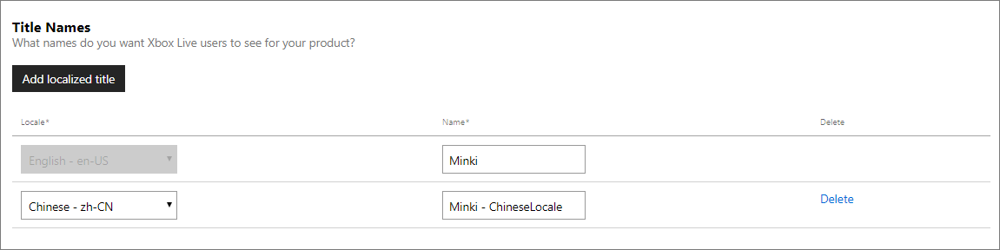
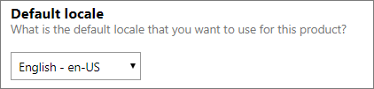
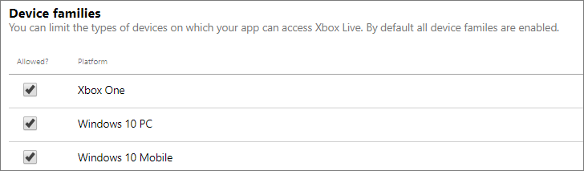
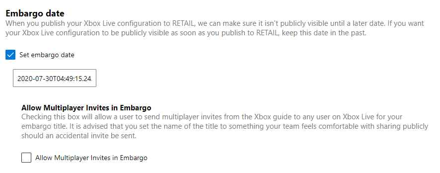
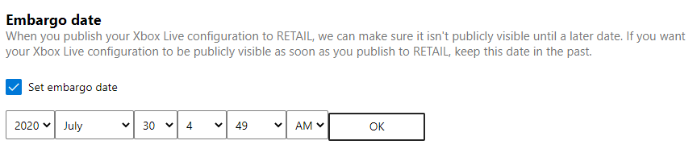

# Configuring Xbox Live Setup in Partner Center

You can use [Partner Center](https://developer.microsoft.com/dashboard) to configure the initial set of Xbox Live properties that are associated with your game.

> [!NOTE]
> This article describes the Partner Center UI for Managed Partners, more than for Creators.

Add configuration by doing the following:

1. Navigate to the **Xbox Live** section for your title, located under **Xbox Live Settings**.

2. On this page, you can set the title names, default locale, device families and the embargo date. Once you are done setting your configuration, click the **Save** button to submit the changes.

## Title names

By clicking on **Add localized title**, you can enter a name for your product and select a language to localize it to.
The title name should map to the localized product names that you have defined on the properties page of the submission.
Default is English (en-US).

## Default locale

This option allows you to set the default language to be used to configure all your strings in the Xbox Live service configuration.
For example, if you set the default locale to Spanish (es-ES) and you want to configure an achievement, then at a minimum, the achievement name and description would have to be in Spanish.

In other words, you cannot set this option to Spanish but only provide the achievement information in English.
All of your Xbox Live service configuration must be provided in the same version as that of the default locale.
By default, the default locale is set to English (en-US).

> [!NOTE]
> Additionally, all strings can be localized in the Localized strings page.

## Device families

This configuration allows you to choose the type of devices on which your title can access Xbox Live.
By default, all device families are enabled.
You can check the devices to enable them.

## XBL Embargo
<!-- This explanation of Embargo was copied from the Partner Center page UI: -->
**What is RETAIL XBL embargo?**

RETAIL XBL Embargo provides additional protections to help limit the product's social data exposure in RETAIL via service calls or in the Xbox UI.
Only the product or its custom access policies will be able to make calls to get the embargoed data.
Users playing a product during the embargo period (via pre-paid token or other means) won't show any of the below content related to the product until the specified embargo date and time is reached.

Note: Calls in the title will not be blocked. This could include features such as sending game invites, as those calls do not go through the XBL Shell.

The date that you select determines when your Xbox Live configuration goes live to the public.
**Important:** Even if you publish your changes to RETAIL, the changes will not go live unless the embargo date has been met.
* If you select a date in the future, the changes will become available to the public on that date.
* If you select a date in the past, the changes will become available to the public as soon as you publish your changes to RETAIL.
* If the Embargo date is updated/changed after you publish to RETAIL, the Service Configuration must be republished; simply clicking **OK** and **Save** will not apply the change.
* The retail embargo feature is intended for titles that have not released their base game. Content Updates to products in RETAIL should opt-out.

XBL Embargo only impacts Xbox Live-related features, and does not impact pricing and availability.
For more information on pricing, see [Pricing and Offers.](https://docs.microsoft.com/partner-center/pricing-and-offers)

**Testing Multiplayer invites in Embargo**

Also available to your title is the ability to send multiplayer invites via the Xbox UI with Embargo enabled. 
> [!NOTE] 
> It is possible to send multiplayer invites to any user on Xbox Live with this feature enabled. 
>
It is recommended that the name you choose for your title is something you are comfortable sharing publicly in case of an accidental invite being sent.
The name chosen will appear in the invite sent to users. To change the name of your title, please see the title names section above.

**Xbox Live features that are embargoed:**

The following table indicates whether the Xbox Live feature is embargoed.

| Feature | XBL Embargoed? | Configuration |
| :--- | :---: | :--- |
| Achievements & Challenges | Y | Service Configuration |
| Stats | Y | Service Configuration |
| Real Time Activity | Y | Service Configuration |
| Game Invites | Y | Service Configuration |
| Game Progress | Y | Service Configuration |
| Hero Stats | Y | Service Configuration |
| Leaderboards | Y | Service Configuration |
| Presence | Y | Service Configuration |
| Game DVR | Y\* | Service Configuration |
| Screenshots | Y\* | Service Configuration |
| Broadcasting | Y\* | Service Configuration |
| Social Sharing | Y\* | Service Configuration |
|Game Hub | N| N/A|
|Marketplace Availabilities|N |N/A |
|Static Files, such as trailers or artwork|N |N/A |
|Title-Callable UI (TCUI)|N |N/A |

Notes for features marked \*:

**To set the embargo date:**

1. In Partner Center, select your title, click **Xbox Live**, and then click **Xbox Live Settings**. The "Xbox Live configuration" page appears.

2. In the **Embargo date** section, select the **Set embargo date** check box.  A date box appears: 

3. Click the date box to expand the date: 

4. Select the date and time.

5. If you you like to also test multiplayer with your title, select the **Allow Multiplayer Invites in Embargo** check box. 

6. Click the **OK** button, and then at the bottom of the page, click the **Save** button.

Note: 
* The embargo date is set, but will not take effect until you have published.
* The UI converts to the local browser time zone for the XBL Embargo date.

## Advanced settings

Multiple points of presence allows the same user to sign in to Xbox Live from multiple devices at the same time.
Xbox Live features such as, achievements and multiplayer will have limited access.
Hence, this option is not recommended for games.

To set the **Multiple points of presence**, click **Show options**.
Enable this option by checking the box.
