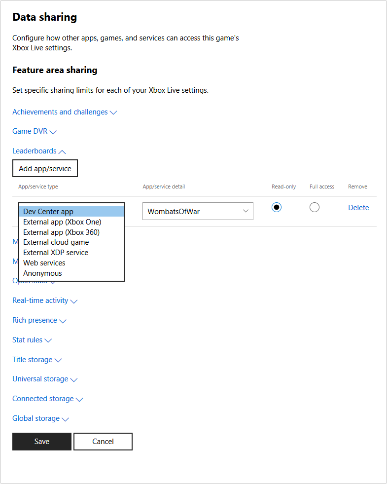

# Configuring data sharing in Partner Center

You can use [Partner Center](https://developer.microsoft.com/dashboard/windows/overview) to allow other services, games, and apps to access your title's Xbox Live settings and data.
For example, you may want a web service to display leaderboards on your website, or you may have a companion app that can access the game's title storage to view or modify saved game data.

> [!NOTE]
> This article does not apply to titles in the Xbox Live Creators Program.

By default, only the title itself can access the settings and data stored on the Xbox Live service.
You can change this by configuring data sharing on Partner Center.

## To add configuration:

1. Go to [Partner Center](https://developer.microsoft.com/dashboard/windows/overview) and then select your title.

2. Navigate to **Services** > **Xbox Live**, then click the **Data sharing** link.  The "Data sharing" page appears.

   

3. Click on the setting you want to grant access to, such as **Game DVR** or **Leaderboards**, and then click the **Add app/service** button.
   A new row is added to the bottom of the list of apps/services configured to access that setting.

4. Select the type of app or service in the drop-down box (such as **Dev Center app** or **Anonymous**), and fill in the detail box to indicate the app, title id, or service id of the app or service that will access the data.

   The **Anonymous** menuitem allows Xbox Live to share game clips within Xbox experiences.

5. Select whether the app or service can only read the data, or if it has full access to the data.

6. Repeat for each setting, and for each app or service that needs access to those settings. You can click **Delete** to remove an entry.

7. When you are finished, click the **Save** button to save your changes.
