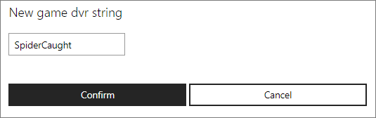

# Configuring Game DVR in Partner Center

On Xbox One, one of the most popular features is Game DVR, which allows gamers easy access to recording, editing and sharing their most epic gaming moments.
The Game DVR strings will appear as the title for any developer-created game DVR clips in your title.

Configuring the string in the service will ensure that the correct localized version of that string shows up in any apps where that clip is featured.
For example, if you wanted to create a clip when a user beats the final boss of your title, you could start by configuring a string called 'Boss Battle'.
When making the call in your title code to create the clip, you would reference the ID.

To configure Game DVR strings that are associated with your game, you can use [Partner Center](https://partner.microsoft.com/dashboard).

**To add a game DVR string:**

1. Go to Partner Center and select your title.

2. In the middle of the window, expand **Xbox Live**, then click **Gameplay settings**. The "Gameplay Setting" page appears.

3. Click **Game DVR** or **Game Clips**. The "Gameplay Setting" page is refreshed and "GameDVR" is underlined in the navigation bar, and the Game Clips information appears.

4. Click the **Create new string** button. The "New game dvr string" dialog box appears.

   

5. Enter the Game DVR string, and then click the **Confirm** button.
