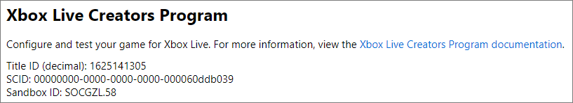

# Using Xbox Live sandboxes, for Creators

You must configure information about your title in <a href="https://partner.microsoft.com/dashboard" target="_blank">Partner Center &#11008;</a>, such as stats, leaderboards, and localization.
See [Xbox Live service configuration IDs, for Creators](../portal-config/live-service-config-ids-creators.md).

Changes to your Xbox Live service configuration need to be published from Partner Center into your development sandbox, before the changes are picked up by the rest of Xbox Live and can be accessed in your title.

A development sandbox allows you to work on changes to your title in an isolated environment.
Sandboxes offer several benefits:
1. You can iterate on changes to an update for your title without affecting the version that is live in production.
2. For security reasons, some tools only work in a development sandbox.
3. Other publishers cannot see what you are working on without being granted access to your sandbox.

By default, Xbox One consoles and Windows 10 PCs are in the RETAIL sandbox.
To access that version of the Xbox Live service configuration, you will need to switch your PC and/or Xbox One to the development sandbox.
If you need to test something in RETAIL, or want to play an Xbox Live game, change the device back to the RETAIL sandbox.

## Finding out about your sandbox

A sandbox is created for you when you create a title.
You can find your Sandbox ID by opening your product in **Partner Center** and navigating to **Services** > **Xbox Live**.
The **Sandbox ID** will be listed at the top of the page.

<!-- =============================================================== -->
## Switch your PC's development sandbox

You can switch your PC into the development sandbox by using Unity, Windows Device Portal (WPD), or the command line.

<!-- --------------- -->
### Unity

#### Prerequisites

The following needs to be done before you can switch in and out of the development sandbox in Unity:

* [Configuring Xbox Live in Unity](../../get-started/setup-ide/creators/unity-win10/live-configure-xbl-in-unity.md)

#### Switch Sandboxes

The built-in Xbox Live Configuration window lets you toggle between your development and RETAIL sandboxes easily.
To start, go to **Xbox Live** > **Configuration** in the menu.
You can see the current sandbox in the **Developer Mode Configuration** section.

1. If **Developer Mode** says **enabled**, you are currently in the development sandbox associated with your game. You can click the **Switch back to Retail Mode** button to switch out.

2. If **Developer Mode** says **disabled**, you are currently in the RETAIL sandbox. You can click the **Switch to Developer Mode** button to switch in.

<!-- --------------- -->
### Windows Device Portal

#### Prerequisites

The following needs to be done before you switch your sandbox in Windows Device Portal (WPD):

1. [Setup Device Portal on Windows Desktop](https://msdn.microsoft.com/windows/uwp/debug-test-perf/device-portal-desktop)

#### Switch Sandboxes

1. Open **Windows Dev Portal** by connecting to it in your web browser, as described in [Setup Device Portal on Windows Desktop](https://msdn.microsoft.com/windows/uwp/debug-test-perf/device-portal-desktop).
2. Click on **Xbox Live**.
3. Enter your development sandbox in the text field, and then click **change**.

To switch back to RETAIL, you can enter RETAIL here.

<!-- --------------- -->
### Command-line

The Xbox Live development tools file (`XboxLiveTools.zip`) contains a command-line tool to switch sandboxes for PC development.
See the section [Xbox Live PC Sandbox Switcher (XBLPCSandbox.exe)](../services-tools/live-tools.md#xpssc) in the article "Development tools for Xbox Live".

<!-- =============================================================== -->
## Switch your Xbox One console development sandbox

<!-- --------------- -->
### Using Xbox Dev Portal

You can use the Xbox Dev Portal to change the sandbox on your console:

1. On your console, go to [Dev Home](https://docs.microsoft.com/windows/uwp/xbox-apps/dev-home).
1. [Enable the Device Portal](https://docs.microsoft.com/windows/uwp/debug-test-perf/device-portal-xbox).
1. In the Xbox Dev Portal, click **Xbox Live**.
1. Enter your development sandbox in the text field and click **change**.

<!-- replace XDP captures by Partner Center captures -->

<!-- --------------- -->
### Using Xbox One console UI

You can use [Dev Home](https://docs.microsoft.com/windows/uwp/xbox-apps/dev-home) to change the sandbox on your console directly:
1. Click **Change Sandbox**, located under **Quick Actions**.
2. Enter the sandbox ID and then click **Save and restart**.

### Sign-In with the Xbox App

Once you've switched your development PC to use the proper sandbox for your title, verify that you're signed in to Xbox Live with an eligible test account.
This can be done by signing into the [Xbox Live App](https://www.xbox.com/en-US/xbox-app).

Once your development environment starts using the desired sandbox, the Xbox App will sign-in users using the same constraints as any other Xbox Live service running on the sandbox.
This makes it useful to verify that you are using a valid account for the sandbox.
