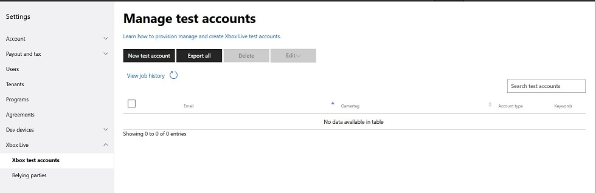
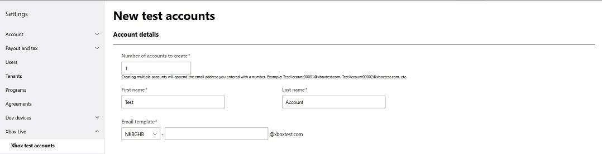

# Xbox Live test accounts

When testing functionality in your title during development you will need Xbox live accounts. Test Accounts can sign into your *Development Sandbox*, whereas a regular MSA cannot due to security restrictions.
See [Sandboxes](../sandboxes/live-sandboxes-nav.md).

It can be time consuming to create and manage multiple Xbox Live Accounts so we have provided an experience to create, update and delete accounts by batch.

Members of the Creators Program can test using Regular MSAs, and can provision such accounts through the Creators Test Account page.

## Types of test accounts

There are two options of test accounts.
Regular MSAs that are provisioned to work in your Development Sandbox, or test accounts that only work in a development sandbox.

If you are developing a title with the Creators Program, you may only use Regular MSAs that are provisioned for your Development Sandbox.

Below we will discuss how to create both types.

## Creator's Program: Provisioning Regular MSAs

If you have a pre-existing Xbox Live Account, a good starting point would be to provision it for use with your Development Sandbox.

If you do not have an existing Xbox Live Account or require additional MSAs, you can create some at [https://account.microsoft.com/account](https://account.microsoft.com/account).

## Managed Partners Program: Creating Xbox Live Test Accounts

If you are in the Managed Partners Program, then you may also create test accounts exclusively for use in your development sandboxes.
You can also create multiple test accounts at once.

To go to the Test Account management page in Partner Center:
1. Go to [Partner Center](https://partner.microsoft.com/dashboard).
2. Click on the gear icon at the top right to go to Developer settings.
3. Expand Xbox Live
4. Click **Xbox test accounts**.

Screenshot showing where to find this:

Once you click on "Xbox test accounts", you will see a summary of any existing test account batches if you have any.
You also have the option to create new test accounts.

You can click on "Create a new account(s)" and you will enter a two page wizard flow to create test accounts.

You can select sandboxes you would like the Test Accounts created within the batch to gain access to. If you do not see any sandbox options available ask your manager to provide you sandbox access.

To view or edit a batch, select the batch name. You will need to wait until creation or update processes have completed before viewing your batch details. You can edit the batch keywords, sandboxes and the expiry date of the sandbox access. On the expiration date, the test accounts in the batch will no longer have access to any sandboxes.

You can then navigate to see the underlying test accounts using the batch accounts left nav option, or click "View batch accounts". There you can search or scroll through the Xbox Live Test Accounts of the batch.

## Exporting Test Accounts

If you are in the Managed Partners Program, then you may also export the test accounts for viewing. 

To go to the Test Account management page in Partner Center:
1. Go to [Partner Center](https://partner.microsoft.com/dashboard).
2. Click on the gear icon at the top right to go to Developer Settings.
3. Expand Xbox Live.
4. Click Xbox Test Accounts.
5. Search or select the batch name you want to export.
6. Click **Export to CSV** on the top right of the page.
7. Save the .csv file locally.
8. Open a new blank sheet in Excel
9. Click on 'Data'
10. Click 'From Text/CSV' and select the .csv file you saved
11. Click Import
12. Click Transform Data and ensure the Xuid column is of Text data type
13. Close and Load

For additional information on importing or exporting with Excel, see [Import or export text (.txt or .csv) files](https://support.office.com/en-us/article/Import-or-export-text-txt-or-csv-files-5250ac4c-663c-47ce-937b-339e391393ba)
