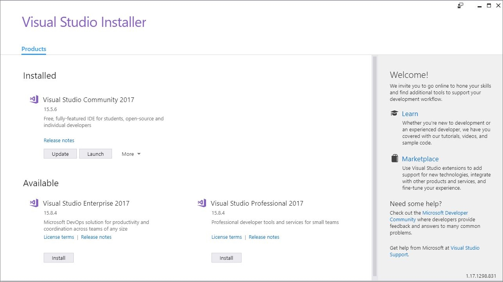
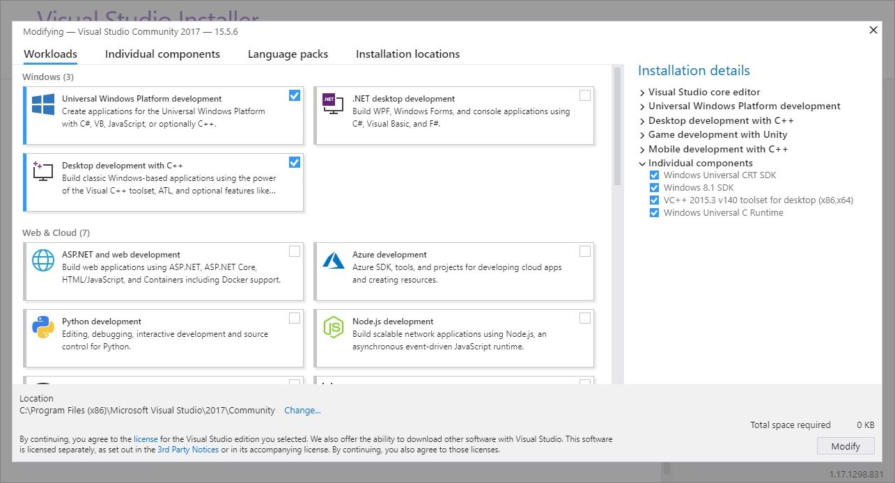

# Setting up Visual Studio for XAL login on Android

This article helps you set up a Visual Studio development environment for your Android project, to enable signing in to Xbox Live.

You must first acquire the source code package for XAL; see [Xbox Authentication Library (XAL) overview](xal-overview.md).


## Requirements

To use the XAL APIs, you need to use Visual Studio 2017 or later.

Your Visual Studio instance will require the following components to use XAL properly:
- Workloads
    - Mobile development with C++
- Individual Components
    - Visual Studio Emulator for Android
    - Android SDK setup (API Level 27)
- Extensions
    - [Java Language Service for Android and Eclipse Android Project Import](https://marketplace.visualstudio.com/items?itemName=VisualCPPTeam.JavaLanguageServiceforAndroidandEclipseAndroidProj )

You can verify that your Visual Studio instance has all the necessary components by opening the **Visual Studio Installer**, clicking **Modify** on your installed Visual Studio instance and checking the Workloads, and Individual Components tabs.
The Java Language extension can be verified separately.

Visual Studio Installer


Visual Studio Installer workloads page



## Setting up the project

[Xbox Authentication Library (XAL) overview](xal-overview.md) gives instructions on how to set up a Visual Studio project for XAL development.
The present section carries the specific instructions for setting up a Xal project for Android development.

> [!TIP]
> Everything you need can be found in the Xal.vs2017.sln. Opening the solution will make it easier to follow along with the rest of the article.


### Project dependencies

In order to use XAL in your Android project you will need to include the following projects and resources in your solution.

First you will need the following XAL resources:

- sdk.xal\Source\Xal\Xal.Android.vcxproj
- sdk.xal\Source\Xal\Xal.Core.vcxitems
- sdk.xal\Source\Xal\Xal.Platform.Common.vcxitems
- sdk.xal\Source\CSharpInterop\CppSource\XalWrapper.Android.vcxproj
- sdk.xal\Source\XalAndroidJava\XalAndroidJava.androidproj

Next you will need the external resources listed below:

- sdk.xal\External\CompactCoreCLL\CompactCoreCLL.Common.vcxitems
- sdk.xal\External\CompactCoreCLL\CompactCoreCLL.Android.vcxproj
- sdk.xal\External\libHttpClient\Build\libcrypto.141.Android\libcrypto.141.Android.vcxproj
- sdk.xal\External\libHttpClient\Build\libHttpClient.141.Android.C\libHttpClient.141.Android.C.vcxproj
- sdk.xal\External\libHttpClient\Build\libHttpClient.141.Android.Java\libHttpClient.141.Android.Java.androidproj
- sdk.xal\External\libHttpClient\Build\libssl.141.Android\libssl.141.Android.vcxproj


### The base projects

In order to setup a new Android project in Visual Studio you will need two base projects, one for handling java code, and one for handling native C++ code.
You will create these two projects which will depend on the resources listed in the previous section.

You will need a project of the type **Base Application** and a second project of the type **Dynamic Shared Library** You can create these by navigating through the **New Project** dialogue.
- Select **File** >> **New** >> **Project**
- Hit the **Visual C++** dropdown
- Hit the **Cross Platform** dropdown and select **Android**
- Select **Basic Application (Android, Gradle)** and create the project
- Repeat the same steps and select **Dynamic Shared Library** instead to create the second project

Your **Basic Application**, and **Dynamic Shared Library** projects will correspond with the projects under the **AndroidTestApp** folder (sdk.xal\Source\AndroidTestApp) of the XAL source package.
**XalAndroidTest** is the **Basic Application**, and **AndroidTestAppJni** is the **Dynamic Shared Library**.
You can use this information to set the dependencies for your projects by comparing them to the dependencies to their corresponding projects in the XAL source package.

Right-click the project and select **Build Dependencies** >> **Project Dependencies...** to see the dependencies for a project.


### Additional configuration steps

There are some additional steps you will need to take before you are XAL ready.
These steps involve the manipulation of project and configuration files.
Most of these steps can be avoided by using the **XalAndroidTest** and **AndroidTestAppJni** projects as the base of your own project, but if you choose to use your own files you will need to take these additional steps.

Open your **Basic Application** project and add the following \**line**, designated by the asterisks, below the **Globals** property group

```xml
  <PropertyGroup Label="Globals">
    <AndroidBuildType>Gradle</AndroidBuildType>
    <RootNamespace>AndroidTestClient</RootNamespace>
    <MinimumVisualStudioVersion>14.0</MinimumVisualStudioVersion>
    <ProjectVersion>1.0</ProjectVersion>
    <ProjectGuid>{67a585c6-70b6-4ad1-a97f-e86811e041fb}</ProjectGuid>
    <_PackagingProjectWithoutNativeComponent>true</_PackagingProjectWithoutNativeComponent>
    <LaunchActivity Condition="'$(LaunchActivity)' == ''">com.microsoft.xaltest.AndroidTestClient</LaunchActivity>
    <JavaSourceRoots>src\main\java</JavaSourceRoots>
    <ConfigurationType>Application</ConfigurationType>
  </PropertyGroup>
  **<Import Project="$([MSBuild]::GetDirectoryNameOfFileAbove($(MSBuildThisFileDirectory), xal.props))\xal.props" />**
```

Open up the **Dynamic Shared Library** project and do the same  

In addition add the following asterisk designated \**lines** to and after the **Globals** Property group.

```xml
  <PropertyGroup Label="Globals">
    <ProjectGuid>{2a3031e0-1aec-4a83-976d-0d583c673e2f}</ProjectGuid>
    <RootNamespace>AndroidTestAppJni</RootNamespace>
    **<XalPlatform>Android</XalPlatform>**
    **<ConfigurationType>DynamicLibrary</ConfigurationType>**
    <ProjectName>AndroidTestAppJni</ProjectName>
  </PropertyGroup>
  **<Import Project="$([MSBuild]::GetDirectoryNameOfFileAbove($(MSBuildThisFileDirectory), xal.props))\xal.props" />**
```

Under the **Basic Application** project open the **build.gradle.template** file under the **app** folder.
Add the **bolded** lines to the dependencies generated by the Visual Studio dependencies.

dependencies {
    compile fileTree(dir: 'libs', include: ['*.jar'])
    **compile 'com.madgag.spongycastle:core:1.58.0.0'**
    **compile 'com.madgag.spongycastle:prov:1.58.0.0'**
    **compile 'com.squareup.okhttp3:okhttp:3.10.0'**
    $(AarDependencies)
}

Under the **Basic Application** project open the **AndroidManifest.xml.template** located under **app** >> **src** >> **main**.
Add the asterisk designated \**lines** to the manifest.

```xml
<manifest xmlns:android="http://schemas.android.com/apk/res/android"
          package="com.microsoft.xaltest"
          android:versionCode="1"
          android:versionName="1.0">
  **<uses-permission android:name="android.permission.INTERNET" />**
  **<uses-permission android:name="android.permission.ACCESS_NETWORK_STATE" />**
  <application
      android:allowBackup="false"
      android:label="@string/app_name">
    <activity 
        android:screenOrientation="portrait"
        android:name=".AndroidTestClient"
        android:label="@string/app_name">
      <intent-filter>
        <action android:name="android.intent.action.MAIN" />
        <category android:name="android.intent.category.LAUNCHER" />
      </intent-filter>
    </activity>
      <activity android:name=".XalWebView"
                android:label="@string/web_name">
      </activity>
  </application>
</manifest>
```


## Java, C++ and JNI

XAL is a C++ library, and android apps can only be written in Java.
Thankfully this will not stop you from using XAL in your android application.

In order to use XAL in an Android project, you will need to wrap the native language C++ so that it can be accessed by Java code.
In order to do this, you must be familiar with the [Java Native Interface(JNI)](https://docs.oracle.com/javase/7/docs/technotes/guides/jni/spec/jniTOC.html).
JNI is what allows managed code like Java, to interact with native code like C/C++ and will be essential to using XAL for android.

Once you are familiar with JNI, you may reference the Android test sample project for an implementation example.
The **AndroidTestApp** found in the XAL sdk is split into two projects **AndroidTestAppJni** and **XalAndroidTest**.
**XalAndroidTest** contains all of the java code for the Android app.

**XalAndroidTest** needs to call XAL in order to achieve Xbox Live sign in.
It does this by using function stubs that will call the native C++ code through the JNI layer which will be written by you the developer.
**XalAndroidTestAppJni** contains the JNI code for the sample project that will call the C++ code on behalf of the Java layer.

Take a look at the **BasicFragment.java** file and you will see many defined functions that will eventually call XAL code.
Let's take the `AddFirstUserSilent()` function defined at the bottom of the java file:

```java
private native void AddFirstUserSilent();
```

This function is implemented in the **AndroidTestAppJni.cpp file**

```java
void Java_com_microsoft_xaltest_BasicFragment_AddFirstUserSilent(JNIEnv* env, jobject instance)
{
    AndroidTestApp::TestApp::GetInstance().XalAddUser(true);
}
```

In the **AndroidTestAppJni**, `AndroidTestApp` is a singleton class which handles all of the XAL calls.
`AndroidTestApp` handles all of the XAL calls by creating instances of the **command** class implemented in **command.cpp**.

These classes contain all of the components necessary for making the async XAL calls.
The `AndroidTestApp` class contains the `AsyncQueue`, and the `AsyncBlock` is handled by the `command` class.

If you are not familiar with `AsyncBlock` and `AsyncQueue`, you will need to familiarize yourself with the C async API calling pattern used for making XAL async calls; see [Making async calls in the XSAPI C API](../../flatc-async-patterns.md).

You may make your XAL calls in this manner, or by the approach described in [XAL common scenarios](xal-sign-in.md).
