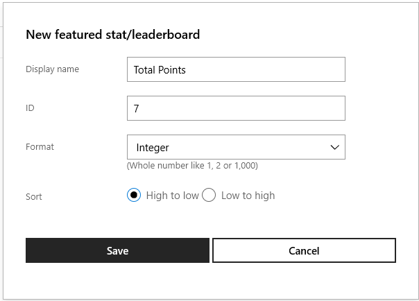

# Configuring Featured Stats and Leaderboards 2017 in Partner Center

For a game to interact with the stats service, a stat needs to be defined in [Partner Center](https://partner.microsoft.com/dashboard). All Featured Stats will show up on the GameHub, which makes it automatically act as a leaderboard. We will store the raw value, however, the game will own the logic for determining if a new value should be provided.

The picture above shows how Featured Stats will look in your title's GameHub. The Featured Stats are shown withing the red box.

With Data Platform 2017, you only need to configure a stat which is used for a social leaderboard that is featured on a player's GameHub page.

You can use Partner Center to configure a featured stat and leaderboard that is associated with your game. Add configuration by doing the following:

1. Navigate to the **Featured Stats and Leaderboards** section for your title, located under **Services** > **Xbox Live** > **Featured Stats and Leaderboards**.
2. Click the **New** button which will open a modal form. Once filled out, click **Save**.

The **Display name** field is what users will see in the GameHub. This string can be localized in the **Localize strings** of the Xbox Live service configuration.

The **ID** field is the stat name and is how you will refer to your stat when updating it from your code. See the [Updating Stats](../../leaderboards-and-stats-2017/player-stats-updating.md) for more details.

The **Format** is the data format of the stat. Options include Integer, Decimal, Percentage, Short timespan, Long timespan and String.

Each **Format** option will give some information on acceptable values or formatting under the drop down when selected.

* Integer stats accept whole numbers like 1, 2, or 100.
* Decimal stats accept fractional numbers with two decimal places like 1.05 or 12.00
* Percentage stats accept whole numbers between 0 and 100. '%' will be appended to the end of the whole number. (e.g. 0%, 100%)
* Short timespan stats follow the HH:MM:SS format like 02:10:30, and will ask you to provide a time unit for the stat.
    The available time units are milliseconds, seconds, minutes, hours, and days.
* Long timespan stat follow the Xd Xh Xm format like 1d 2h 10m, this stat will also ask you to provide a time unit for the stat.

The **Sort** field lets you change the sort order of the leaderboard to be either ascending or descending.

Please note the following requirements when configuring a featured stat and leaderboard:

| Developer Type | Requirement | Limit |
|----------------|-------------|-------|
| Xbox Live Creators Program | There is no requirement to designate any stats as Featured Stats | 20 |
| ID@Xbox and Microsoft Partners | You must designate at least 3 Featured Stats | 20 |

## Next steps

Next, update the stats from your code; see [Updating Stats](../../leaderboards-and-stats-2017/player-stats-updating.md).
