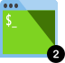

    

        <ul class="cardsY panelContent featuredContent">
            <li>
                <a href="">
                    

                        

                            

                                

                                    

                                        
                                    

                                

                                

                                    Explore XBL Documentation Story
                                

                            

                        

                    

                </a>
            </li>
            <li>
                <a href="">
                    

                        

                            

                                

                                    

                                        
                                    

                                

                                

                                    Xbox Live University: Learn for free online
                                

                            

                        

                    

                </a>
            </li>
            <li>
                <a href="">
                    

                        

                            

                                

                                    

                                        
                                    

                                

                                

                                    Free Azure Courses from Pluralsight
                                

                            

                        

                    

                </a>
            </li>
        </ul>
    

    

        <h1 class="visually-hidden">Xbox Live developer guide</h1>
        <ul class="pivots">
            <li>
                <a href="#getstarted">Get Started</a>
                <ul id="getstarted">
                    <li>
                        
                        <ul id="getstarted-all" class="cardsF">
                            <li>
                                

                                    <h2>Program Overviews</h2>
                                

                            </li>
                            <li>
                                

                                    

                                        

                                            

                                                

                                                    
                                                

                                            

                                            

                                                <h3>Creator Program</h3>
                                                

                                                    <a href="get-started.md">Get Started</a>
                                                

                                                

                                                    <a href="">Overview</a>
                                                

                                            

                                        

                                    

                                

                            </li>
                            <li>
                                

                                    

                                        

                                            

                                                

                                                    
                                                

                                            

                                            

                                                <h3>ID@XBOX Program</h3>
                                                

                                                    <a href="get-started.md">Get Started</a>
                                                

                                                

                                                    <a href="">Overview</a>
                                                

                                            

                                        

                                    

                                

                            </li>
                            <li>
                                

                                    <h2>Configuration and Testing</h2>
                                

                            </li>
                            <li>
                                

                                    

                                        

                                            

                                                

                                                    
                                                

                                            

                                            

                                                <h3>Configure XBL</h3>
                                                

                                                    <a href="get-started.md">Get Started</a>
                                                

                                                

                                                    <a href="">Overview</a>
                                                

                                            

                                        

                                    

                                

                            </li>
                            <li>
                                

                                    

                                        

                                            

                                                

                                                    
                                                

                                            

                                            

                                                <h3>XBL Sandboxes</h3>
                                                

                                                    <a href="get-started.md">Get Started</a>
                                                

                                                

                                                    <a href="xbox-live-sandboxes.md">Overview</a>
                                                

                                            

                                        

                                    

                                

                            </li>
                            <li>
                                

                                    

                                        

                                            

                                                

                                                    
                                                

                                            

                                            

                                                <h3>Create Test Accounts</h3>
                                                

                                                    <a href="get-started.md">Get Started</a>
                                                

                                                

                                                    <a href="xbox-live-test-accounts.md">Overview</a>
                                                

                                            

                                        

                                    

                                

                            </li>
                            <li>
                                

                                    

                                        

                                            

                                                

                                                    Test on Xbox One Console" />
                                                

                                            

                                            

                                                <h3>Test on Xbox One Console</h3>
                                                

                                                    <a href="get-started.md">Get Started</a>
                                                

                                                

                                                    <a href="testing-on-console.md">Overview</a>
                                                

                                            

                                        

                                    

                                

                            </li>
                            <li>
                                

                                    <h2>Tools</h2>
                                

                            </li>
                            <li>
                                

                                    

                                        

                                            

                                                

                                                    
                                                

                                            

                                            

                                                <h3>Use XBL</h3>
                                                

                                                    <a href="get-started.md">Get Started</a>
                                                

                                                

                                                    <a href="using-xbox- live.md">Overview</a>
                                                

                                            

                                        

                                    

                                

                            </li>
                            <li>
                                

                                    

                                        

                                            

                                                

                                                    
                                                

                                            

                                            

                                                <h3>Developer Resources</h3>
                                                

                                                    <a href="get-started.md">Get Started</a>
                                                

                                                

                                                    <a href="xbox-live-resources.md">Overview</a>
                                                

                                            

                                        

                                    

                                

                            </li>
                            <li>
                                

                                    

                                        

                                            

                                                

                                                    
                                                

                                            

                                            

                                                <h3>Porting XBL Code</h3>
                                                

                                                    <a href="get-started.md">Get Started</a>
                                                

                                                

                                                    <a href="porting-xbox- live-code-from-xdk-to-uwp.md">Overview</a>
                                                

                                            

                                        

                                    

                                

                            </li>
                        </ul>
                    </li>
                </ul>
            </li>
            <li>
                <a href="#feature">Feature Knowledge</a>
                <ul id="feature">
                    <li>
                        
                        <ul id="feature-all" class="cardsA">
                            <li>
                                <a href="features.md">
                                    

                                        

                                            

                                                

                                                    

                                                        
                                                    

                                                

                                                

                                                    <h3>Feature Knowledge</h3>
                                                    
The Xbox Live Creators Program allows you to quickly and directly publish your games to Xbox One and Windows 10, with a simplified certification process and no concept approval required.

                                                

                                            

                                        

                                    

                                </a>
                            </li>
                            <li>
                                <a href="">
                                    

                                        

                                            

                                                

                                                    

                                                        
                                                    

                                                

                                                

                                                    <h3>Social Platform</h3>
                                                    
Tools to enhance the social aspect of any XBL experience.

                                                

                                            

                                        

                                    

                                </a>
                            </li>
                            <li>
                                <a href="">
                                    

                                        

                                            

                                                

                                                    

                                                        
                                                    

                                                

                                                

                                                    <h3>Data Platform</h3>
                                                    
Provision any title to run as a service while incorporating engagement driving features.

                                                

                                            

                                        

                                    

                                </a>
                            </li>
                            <li>
                                <a href="">
                                    

                                        

                                            

                                                

                                                    

                                                        
                                                    

                                                

                                                

                                                    <h3>Storage Platform</h3>
                                                    
Enable global title data and player specific data in the cloud.

                                                

                                            

                                        

                                    

                                </a>
                            </li>
                            <li>
                                <a href="">
                                    

                                        

                                            

                                                

                                                    

                                                        
                                                    

                                                

                                                

                                                    <h3>Multiplayer Platform</h3>
                                                    
Utilize a set of client API’s to impliment real-time multiplayer gameplay.

                                                

                                            

                                        

                                    

                                </a>
                            </li>
                            <li>
                                <a href="">
                                    

                                        

                                            

                                                

                                                    

                                                        
                                                    

                                                

                                                

                                                    <h3>Contextual Search</h3>
                                                    
Automatically tag broadcasts and game clips from a title with real time stats.

                                                

                                            

                                        

                                    

                                </a>
                            </li>
                            <li>
                                <a href="">
                                    

                                        

                                            

                                                

                                                    

                                                        
                                                    

                                                

                                                

                                                    <h3>Real Time Activity Search</h3>
                                                    
Allow an application on any device to subscribe to state data, user statistics, and presence.

                                                

                                            

                                        

                                    

                                </a>
                            </li>
                        </ul>
                    </li>
                </ul>
            </li>
        </ul>
    

