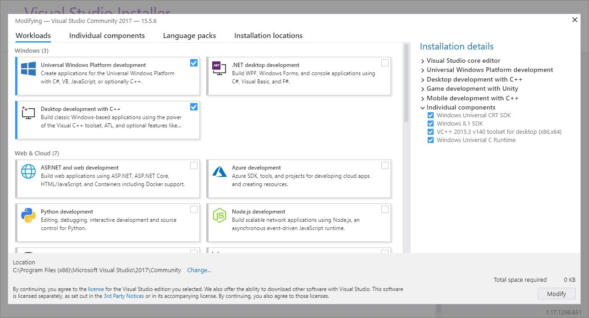

# XAL on Win32

Once you have acquired the source code package for XAL per [Xbox Live Authentication Library (XAL) overview](xal-overview.md), set up a Visual Studio development environment, as follows.

## Requirements

You will need to use Visual Studio 2017 or later in order to use the XAL APIs.
Your Visual Studio instance will require the following components to use XAL properly.

- Workloads
    - .NET desktop development
    - Desktop development with C++
    - Universal Windows Platfrom development
- Individual Components
    - Win 8.1 SDK
    - Windows Universal CRT SDK

You can verify that your Visual Studio instance has all the necessary components by opening the **Visual Studio Installer**, clicking **Modify** on your installed Visual Studio instance and checking the **Workloads**, and **Individual Components** tabs.

Visual Studio Installer

Visual Studio Installer workloads page

## Setup and sign-in

[Xbox Live Authentication Library (XAL) overview](xal-overview.md#integrate-xal-into-visual-studio) covers how to setup your Visual Studio 2017 project to develop with XAL, so you will not need to take any additional steps.
Once your environment is set up, you will be able to implement the code described in the [XAL best practices article](xal-sign-in.md).

Since Win32 is already a C++ environment, you will not need to take further steps to implement XAL sign-in.
